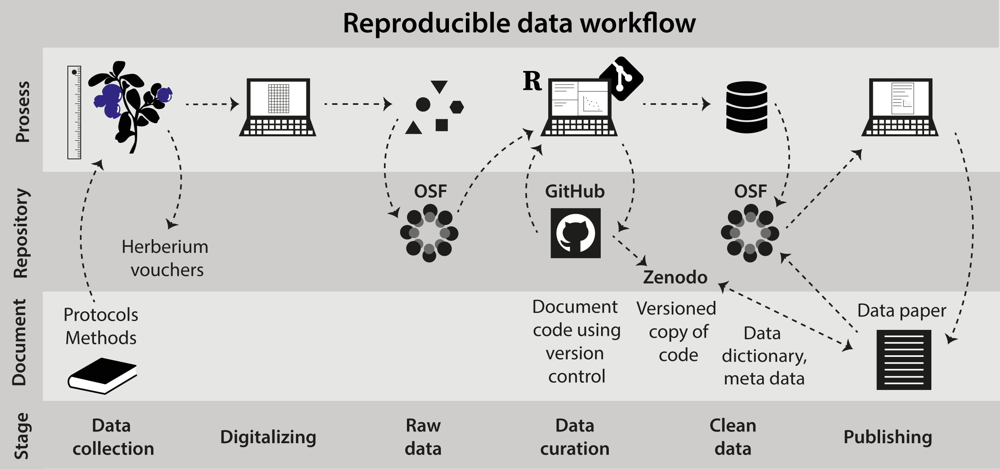
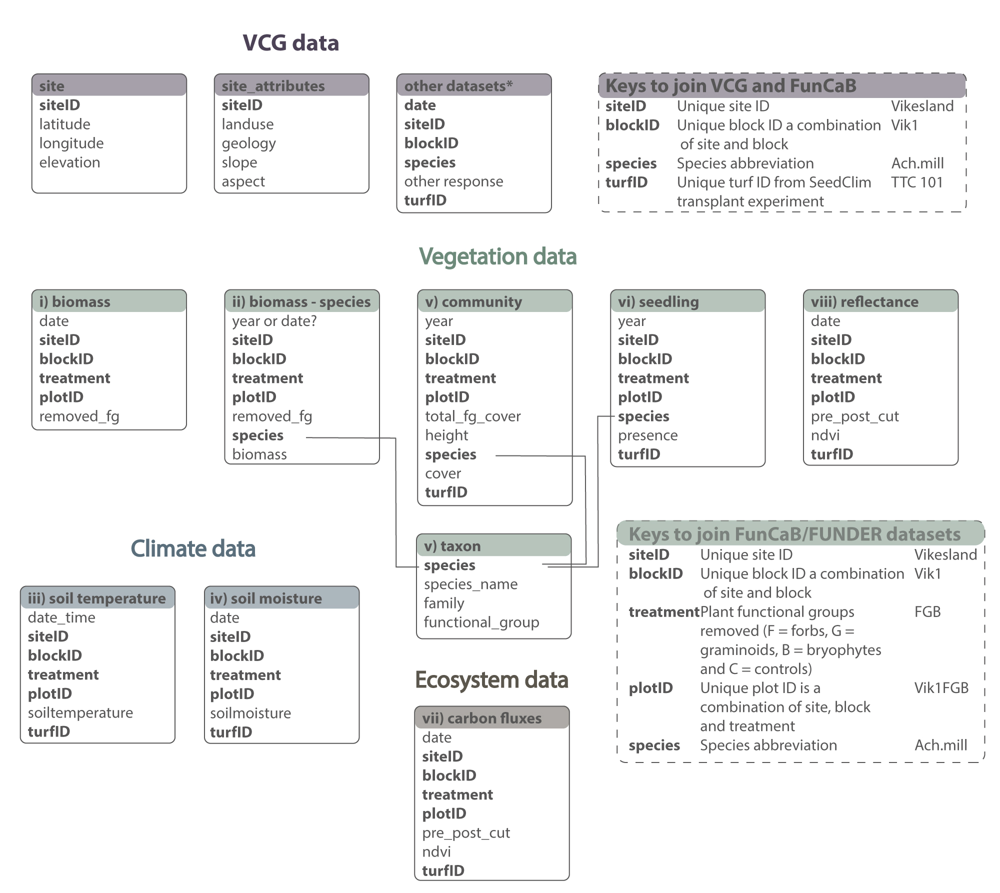

```{r setup, out.width='100%', include = FALSE}
knitr::opts_chunk$set(collapse = TRUE, 
                      comment = "#>", 
                      message = FALSE, 
                      warning = FALSE, 
                      eval = TRUE,
                      echo = FALSE)
library("tidyverse")
library("lubridate")
library("readxl")
library("tibble")
library("dataDownloader")
library("kableExtra")


theme_set(theme_bw(base_size = 12))


# Data
source("R/data_dic/data_dic.R")

biomass <- read_csv("data/biomass/FunCaB_clean_biomass_2015-2021.csv")
community <- read_csv("data/community/FunCaB_clean_composition_2015-2019.csv")
cflux <- read_csv(file = "data/cflux/FunCaB_clean_Cflux_2015-2017.csv")


meta <- biomass %>% 
  distinct(siteID) %>% 
  mutate(biogeographic_zone = recode(siteID,
                             Ulvehaugen = "alpine",
                             Lavisdalen = "alpine",
                             Gudmedalen = "alpine",
                             Skjelingahaugen = "alpine",
                             Alrust = "sub.alpine",
                             Hogsete = "sub.alpine",
                             Rambera = "sub.alpine",
                             Veskre = "sub.alpine",
                             Fauske = "boreal",
                             Vikesland = "boreal",
                             Arhelleren = "boreal",
                             Ovstedalen = "boreal"),
        prep_level = recode(siteID,
                               Ulvehaugen = 1,
                               Lavisdalen = 2,
                               Gudmedalen = 3,
                               Skjelingahaugen = 4,
                               Alrust = 1,
                               Hogsete = 2,
                               Rambera = 3,
                               Veskre = 4,
                               Fauske = 1,
                               Vikesland = 2,
                               Arhelleren = 3,
                               Ovstedalen = 4),
        climate = paste0(biogeographic_zone, prep_level),
        climate = factor(climate, levels = c("boreal1", "boreal2", "boreal3", "boreal4", "sub.alpine1", "sub.alpine2", "sub.alpine3", "sub.alpine4", "alpine1", "alpine2", "alpine3", "alpine4")))

```

# FunCaB - The role of functional group interactions in mediating climate change impacts on the Carbon dynamics and biodiversity of alpine ecosystems


This is the git repository for the FunCaB project and base for the data paper:
Vandvik et al. 2022 _Scientific Data_. Data descriptor: The role of Functional group interactions in mediating climate change impacts on the Carbon dynamics and Biodiversity of alpine ecosystems (FunCaB).


## Summary

Plant removal experiments allow assessment of the role of biotic interactions among species or functional groups in community assembly and ecosystem functioning. 
When replicated along climate gradients, they can assess changes in interactions among species or functional groups with climate. 
Across twelve sites in the Vestland Climate Grid (VCG) spanning 4°C in growing season temperature and 2000 mm in mean annual precipitation across boreal and alpine regions of Western Norway, we conducted a fully factorial plant functional group removal experiment (graminoids, forbs, bryophytes). 
Over six years, we recorded biomass removed, soil microclimate, plant community composition and structure, seedling recruitment, ecosystem carbon fluxes, and reflectance in 384 experimental and control plots. 
The dataset consists of 5,412 biomass records, 360 species-level biomass records, 1,084,970 soil temperature records, 4,771 soil moisture records, 17,184 plant records covering 206 taxa, 16,656 seedling records, 3,696 ecosystem carbon flux measurements, and 1,244 reflectance measurements. 
The data can be combined with longer-term climate data and plant population, community, ecosystem, and functional trait data collected within the VCG. 


## Data management and workflows 

We adopt best-practice approaches for open and reproducible research planning, execution, reporting, and management throughout the project. 
Specifically, we use community-approved standards for experimental design and data collection, and clean and manage the data using a fully scripted and reproducible data workflow, with data and code deposited at open repositories. 

```{r rep-workflow}



```

**Project description**, **data dictionaries**, and the overview of all **data sets** are in the data paper (Vandvik et al. 2022).

The **raw** and **clean data** from the project are stored and available on **OSF**: https://osf.io/4c5v2/

All **R code** to clean and curate the data is on **GitHub repository**: https://github.com/Between-the-Fjords/funcab_data

## Datasets

The following datasets are available:

```{r datasets}

tibble(Number = c("i", "ii", "iii", "iv", "v", "vi", "vii", "viii"),
       Variable = c("Biomass removal", "Forb species biopmass", "Soil temperature", "Soil moisture", "Plant community composition", "Seedling recruitment", "Ecosystem carbon fluxes", "Reflectance"),
       Period = c("2015 - 2021", "2016", "2015 - 2016", "2015 - 2018", "2015 - 2019", "2018 - 2019", "2015 - 2017", "2019, 2021"),
       Filename = c("FunCaB_clean_biomass_2015-2021.csv",
                    "FunCaB_clean_species_biomass_2016.csv",
                    "FunCaB_clean_soiltemperature_2015-2016.csv",
                    "FunCaB_clean_soilMoisture_2015-2018.csv",
                    "FunCaB_clean_composition_2015-2018.csv", 
                    "FunCaB_clean_recruitment_2018-2019", 
                    "FunCaB_clean_Cflux_2015-2017.csv", 
                    "FunCaB_clean_reflectance_2019_2021")) %>% 
  kbl()
```


### Data structure

Data structure for the FunCaB biomass removal and forb species biomass (datasets i, ii), soil temperature and moisture (datasets iii, iv) plant community composition (dataset v), seedling recruitment (dataset vi), ecosystem carbon fluxes (dataset vii) and reflectance (dataset viii) is shown below in Figure 1 (data tables = boxes).
Names of individual data tables are given in the grey title area, and variables within tables in the internal lists.
Lines link species as a variable across tables, note that this is just an example, all bold variables are in common between tables and can be used as keys to join them (described in hatched boxes, including an example value for each variable on the right).
Keys can also be used to link to/from data from other projects in the same system (for other VCG project keys, see top right box). Other datasets* refer to extensive dataset on plant community composition, cover, biomass, fitness, and reproduction available from previous projects in the VCG.

```{r data-structure}



```


### Naming conventions across datasets

This is the naming convention used across the datasets and can be used to link the datasets.
These variables are also used in the datasets from the Vestland Climate Grid (VCG) and can be used to join these datasets.
Note that the turfID contains information about the control plots from the VCG.

| Data or file  | Description of naming convention  | Example  |
|:---|:---|:---|
| File names  | Project_status_Dataset_Year.extension  | FunCaB_clean_biomass_2015-2021.csv  |
| year  | Year of observation | 2015 |
| date  | Date of observation | yyyy-mm--dd |
| date_time  | Date and time of observation | yyyy-mm-dd hh-mm-ss |
| siteID  | Unique siteID | Vikesland |
| blockID  | Unique blockID as a combination of siteID and block number | Arh3  |
| plotID  | Unique plotID as a combination of siteID, block and treatment | Arh3FGB  |
| treatment  | Treatment of functional group removal indicating which groups have been removed; F = forbs, G = graminoids, B = bryophytes, C = controls, XC = extra controls | XC, C, B, F, G, FB, GB, GF, FGB |
| turfID  | Unique turfID corresponding to the Vestland Climate Grid control plots | Arh3FGB  |
| species  | Vascular plant taxon names follow for Norway (Lid J & Lid, 2010). The full taxa is written using genus and species with a blank. | Rancunculus acris|
| responses  | response variable | cover, biomass, Reco, etc. |


## Data and data dictionaries

### Biomass removal


```{r biomass, out.width="100%"}

knitr::include_graphics("Datapaper/biomass_plot_rotated.jpeg", )

# biomass_plot <-  biomass %>%
#   filter(removed_fg %in% c("F", "B", "G")) %>%
#   left_join(meta, by = c("siteID")) %>%
#    mutate(treatment = factor(treatment, levels = c("B", "F", "G", "FB", "GB", "GF", "FGB", "XC")),
#           year = factor(year, levels = c("2021", "2020", "2019", "2018", "2017", "2016", "2015"))) %>%
#   ggplot(aes(x = treatment, y = biomass, fill = removed_fg)) +
#   geom_col() +
#   scale_fill_manual(name = "Functional group", values = c("orange", "purple", "limegreen"),
#                     guide = guide_legend(direction = "vertical",
#                                          title.position = "left",
#                                          title.theme = element_text(angle = 90),
#                                          #label.position="right",
#                                          label.hjust = 0.5, label.vjust = 0.5,
#                                          label.theme = element_text(angle = 90))) +
#   labs(x = "Removal treatment", y = "Removed functional group biomass in g") +
#   facet_grid(year ~ climate) +
#   theme_bw() +
#   theme(axis.text.x  = element_text(angle=90, vjust=0.5),
#         #axis.title.x = element_text(angle=90),
#         strip.text.y.right = element_text(angle = 90))
# 
# biomass_plot

#ggsave(filename = "biomass_plot.pdf")

```


```{r biomass-dic}
 knitr::kable(biomass_dic)
```


### Soil microclimate

```{r soiltemp-dic}
 knitr::kable(soil_temperature_dic)
```

```{r soilmoist-dic}
 knitr::kable(soilmoisture_dic)
```


### Plant community composition

``` {r community}

comm_data <- community %>%
  select(year, siteID:total_bryophytes, -turfID) %>%
  filter(treatment %in% c("C", "FB", "GB", "GF"),
         year != 2016) %>%
  #filter(blockID == "Alr5") %>%
  distinct() %>%
  mutate(total_graminoids = if_else(year == 2015 & treatment %in% c("GB", "GF"), NA_real_, total_graminoids),
         total_forbs = if_else(year == 2015 & treatment %in% c("FB", "GF"), NA_real_, total_forbs),
         total_bryophytes = if_else(year == 2015 & treatment %in% c("FB", "GB"), NA_real_, total_bryophytes)) %>%
  group_by(year, siteID, treatment) %>%
  summarise_at(c("total_graminoids", "total_forbs", "total_bryophytes"), mean, na.rm = TRUE) %>%
  pivot_longer(cols = c(total_graminoids, total_forbs, total_bryophytes), names_to = "fg", values_to = "fg_cover") %>%
  pivot_wider(names_from = treatment, values_from = fg_cover) %>%
  mutate(Forbs = GB - C,
         Graminoids = FB - C,
         Bryophytes = GF - C) %>%
  select(-C, -FB, -GB, -GF) %>%
  pivot_longer(cols = c(Forbs, Graminoids, Bryophytes), names_to = "FunctionalGroup", values_to = "Cover") %>%
  filter(!is.na(Cover)) %>%
  mutate(FunctionalGroup = factor(FunctionalGroup, levels = c("Graminoids", "Forbs", "Bryophytes")))

community_plot <- comm_data %>%
  left_join(meta %>% 
              distinct(siteID, biogeographic_zone, prep_level), by = "siteID") %>% 
  mutate(biogeographic_zone = factor(biogeographic_zone, levels = c("alpine", "sub.alpine", "boreal")),
         prec_level = as.character(prep_level),
         prec_level = recode(prep_level, "1" = "700 mm", "2" = "1400 mm", "3" = "2100 mm", "4" = "2800 mm"),
         prec_level = factor(prec_level, levels = c("700 mm", "1400 mm",  "2100 mm", "2800 mm")),
         year = as.Date(ISOdate(year, 1, 1))) %>% 
  ggplot(aes(x = year, y = Cover, colour = FunctionalGroup)) +
  geom_line() +
  geom_hline(yintercept = 0, colour = "grey40", linetype = "dashed") +
  labs(y = "∆cover (treatment - control)") +
  scale_colour_manual(name = "Functional group", values = c("limegreen", "purple", "orange")) +
  scale_x_date(date_labels="%y") +
  facet_grid(biogeographic_zone ~ prec_level) +
  theme_set(theme_bw(base_size = 18)) +
  theme(legend.position="top")

community_plot

#ggsave(filename = "community_plot.pdf")

```

```{r community-dic}
 knitr::kable(community_dic)
```


### Ecosystem carbon fluxes

``` {r cflux}


cflux %>%
  filter(year == 2017) %>%
  left_join(meta, by = c("siteID")) %>%
  mutate(treatment = factor(treatment, levels = c("C", "B", "F", "G", "FB", "GB", "GF", "FGB")),
         biogeographic_zone = factor(biogeographic_zone, levels = c("alpine", "sub.alpine", "boreal"))) %>%
  ggplot(aes(y = gpp, treatment)) +
  geom_boxplot() +
  facet_grid(biogeographic_zone ~ prep_level)


```


```{r cflux-dic}
 knitr::kable(cflux_dic)
```


### Reflectance

```{r reflectance-dic}
 knitr::kable(reflectance_dic)
```
