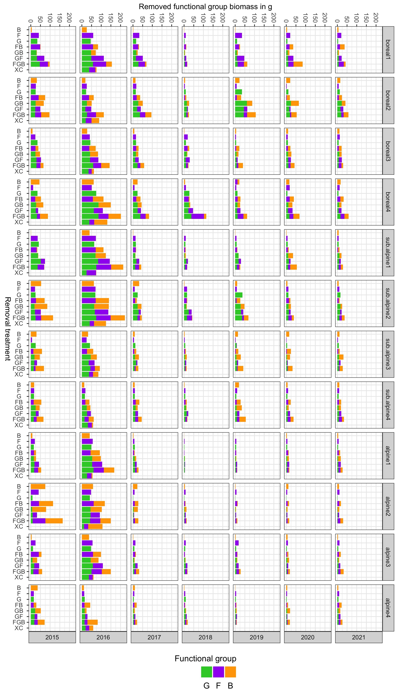

# FunCaB - The role of functional group interactions in mediating climate change impacts on the Carbon dynamics and biodiversity of alpine ecosystems

This is the git repository for the FunCaB project and base for the data
paper: Vandvik et al. 2022 *Scientific Data*. Data descriptor: The role
of Functional group interactions in mediating climate change impacts on
the Carbon dynamics and Biodiversity of alpine ecosystems (FunCaB).

## Summary

Plant removal experiments allow assessment of the role of biotic
interactions among species or functional groups in community assembly
and ecosystem functioning. When replicated along climate gradients, they
can assess changes in interactions among species or functional groups
with climate. Across twelve sites in the Vestland Climate Grid (VCG)
spanning 4°C in growing season temperature and 2000 mm in mean annual
precipitation across boreal and alpine regions of Western Norway, we
conducted a fully factorial plant functional group removal experiment
(graminoids, forbs, bryophytes). Over six years, we recorded biomass
removed, soil microclimate, plant community composition and structure,
seedling recruitment, ecosystem carbon fluxes, and reflectance in 384
experimental and control plots. The dataset consists of 5,412 biomass
records, 360 species-level biomass records, 1,084,970 soil temperature
records, 4,771 soil moisture records, 17,184 plant records covering 206
taxa, 16,656 seedling records, 3,696 ecosystem carbon flux measurements,
and 1,244 reflectance measurements. The data can be combined with
longer-term climate data and plant population, community, ecosystem, and
functional trait data collected within the VCG.

## Data management and workflows

We adopt best-practice approaches for open and reproducible research
planning, execution, reporting, and management throughout the project.
Specifically, we use community-approved standards for experimental
design and data collection, and clean and manage the data using a fully
scripted and reproducible data workflow, with data and code deposited at
open repositories.

<!-- -->

**Project description**, **data dictionaries**, and the overview of all
**data sets** are in the data paper (Vandvik et al. 2022).

The **raw** and **clean data** from the project are stored and available
on **OSF**: <https://osf.io/4c5v2/>

All **R code** to clean and curate the data is on **GitHub repository**:
<https://github.com/Between-the-Fjords/funcab_data>

## Datasets

The following datasets are available:

<table>
<thead>
<tr>
<th style="text-align:left;">
Number
</th>
<th style="text-align:left;">
Variable
</th>
<th style="text-align:left;">
Period
</th>
<th style="text-align:left;">
Filename
</th>
</tr>
</thead>
<tbody>
<tr>
<td style="text-align:left;">
i
</td>
<td style="text-align:left;">
Biomass removal
</td>
<td style="text-align:left;">
2015 - 2021
</td>
<td style="text-align:left;">
FunCaB_clean_biomass_2015-2021.csv
</td>
</tr>
<tr>
<td style="text-align:left;">
ii
</td>
<td style="text-align:left;">
Forb species biopmass
</td>
<td style="text-align:left;">
2016
</td>
<td style="text-align:left;">
FunCaB_clean_species_biomass_2016.csv
</td>
</tr>
<tr>
<td style="text-align:left;">
iii
</td>
<td style="text-align:left;">
Soil temperature
</td>
<td style="text-align:left;">
2015 - 2016
</td>
<td style="text-align:left;">
FunCaB_clean_soiltemperature_2015-2016.csv
</td>
</tr>
<tr>
<td style="text-align:left;">
iv
</td>
<td style="text-align:left;">
Soil moisture
</td>
<td style="text-align:left;">
2015 - 2018
</td>
<td style="text-align:left;">
FunCaB_clean_soilMoisture_2015-2018.csv
</td>
</tr>
<tr>
<td style="text-align:left;">
v
</td>
<td style="text-align:left;">
Plant community composition
</td>
<td style="text-align:left;">
2015 - 2019
</td>
<td style="text-align:left;">
FunCaB_clean_composition_2015-2018.csv
</td>
</tr>
<tr>
<td style="text-align:left;">
vi
</td>
<td style="text-align:left;">
Seedling recruitment
</td>
<td style="text-align:left;">
2018 - 2019
</td>
<td style="text-align:left;">
FunCaB_clean_recruitment_2018-2019
</td>
</tr>
<tr>
<td style="text-align:left;">
vii
</td>
<td style="text-align:left;">
Ecosystem carbon fluxes
</td>
<td style="text-align:left;">
2015 - 2017
</td>
<td style="text-align:left;">
FunCaB_clean_Cflux_2015-2017.csv
</td>
</tr>
<tr>
<td style="text-align:left;">
viii
</td>
<td style="text-align:left;">
Reflectance
</td>
<td style="text-align:left;">
2019, 2021
</td>
<td style="text-align:left;">
FunCaB_clean_reflectance_2019_2021
</td>
</tr>
</tbody>
</table>

### Data structure

Data structure for the FunCaB biomass removal and forb species biomass
(datasets i, ii), soil temperature and moisture (datasets iii, iv) plant
community composition (dataset v), seedling recruitment (dataset vi),
ecosystem carbon fluxes (dataset vii) and reflectance (dataset viii) is
shown below in Figure 1 (data tables = boxes). Names of individual data
tables are given in the grey title area, and variables within tables in
the internal lists. Lines link species as a variable across tables, note
that this is just an example, all bold variables are in common between
tables and can be used as keys to join them (described in hatched boxes,
including an example value for each variable on the right). Keys can
also be used to link to/from data from other projects in the same system
(for other VCG project keys, see top right box). Other datasets\* refer
to extensive dataset on plant community composition, cover, biomass,
fitness, and reproduction available from previous projects in the VCG.

<!-- -->

### Naming conventions across datasets

This is the naming convention used across the datasets and can be used
to link the datasets. These variables are also used in the datasets from
the Vestland Climate Grid (VCG) and can be used to join these datasets.
Note that the turfID contains information about the control plots from
the VCG.

| Data or file | Description of naming convention                                                                                                                              | Example                            |
|:-------------|:--------------------------------------------------------------------------------------------------------------------------------------------------------------|:-----------------------------------|
| File names   | Project_status_Dataset_Year.extension                                                                                                                         | FunCaB_clean_biomass_2015-2021.csv |
| year         | Year of observation                                                                                                                                           | 2015                               |
| date         | Date of observation                                                                                                                                           | yyyy-mm–dd                         |
| date_time    | Date and time of observation                                                                                                                                  | yyyy-mm-dd hh-mm-ss                |
| siteID       | Unique siteID                                                                                                                                                 | Vikesland                          |
| blockID      | Unique blockID as a combination of siteID and block number                                                                                                    | Arh3                               |
| plotID       | Unique plotID as a combination of siteID, block and treatment                                                                                                 | Arh3FGB                            |
| treatment    | Treatment of functional group removal indicating which groups have been removed; F = forbs, G = graminoids, B = bryophytes, C = controls, XC = extra controls | XC, C, B, F, G, FB, GB, GF, FGB    |
| turfID       | Unique turfID corresponding to the Vestland Climate Grid control plots                                                                                        | Arh3FGB                            |
| species      | Vascular plant taxon names follow for Norway (Lid J & Lid, 2010). The full taxa is written using genus and species with a blank.                              | Rancunculus acris                  |
| responses    | response variable                                                                                                                                             | cover, biomass, Reco, etc.         |

## Data and data dictionaries

### Biomass removal

<table>
<thead>
<tr>
<th style="text-align:left;">
Variable name
</th>
<th style="text-align:left;">
Description
</th>
<th style="text-align:left;">
Variable type
</th>
<th style="text-align:left;">
Variable range or levels
</th>
<th style="text-align:left;">
Units
</th>
<th style="text-align:left;">
How measured
</th>
</tr>
</thead>
<tbody>
<tr>
<td style="text-align:left;">
year
</td>
<td style="text-align:left;">
Year of sampling
</td>
<td style="text-align:left;">
numeric
</td>
<td style="text-align:left;">
2015 - 2021
</td>
<td style="text-align:left;">
yyyy
</td>
<td style="text-align:left;">
defined
</td>
</tr>
<tr>
<td style="text-align:left;">
date
</td>
<td style="text-align:left;">
Date of sampling
</td>
<td style="text-align:left;">
date
</td>
<td style="text-align:left;">
2015-07-22 - 2021-07-30
</td>
<td style="text-align:left;">
yyyy-mm-dd
</td>
<td style="text-align:left;">
defined
</td>
</tr>
<tr>
<td style="text-align:left;">
round
</td>
<td style="text-align:left;">
Round of sampling
</td>
<td style="text-align:left;">
numeric
</td>
<td style="text-align:left;">
1 - 2
</td>
<td style="text-align:left;">
count
</td>
<td style="text-align:left;">
defined
</td>
</tr>
<tr>
<td style="text-align:left;">
siteID
</td>
<td style="text-align:left;">
Unique site ID
</td>
<td style="text-align:left;">
categorical
</td>
<td style="text-align:left;">
Alrust - Vikesland
</td>
<td style="text-align:left;">
NA
</td>
<td style="text-align:left;">
defined
</td>
</tr>
<tr>
<td style="text-align:left;">
blockID
</td>
<td style="text-align:left;">
Unique block ID a combination of site and block
</td>
<td style="text-align:left;">
categorical
</td>
<td style="text-align:left;">
Alr1 - Vik5
</td>
<td style="text-align:left;">
NA
</td>
<td style="text-align:left;">
defined
</td>
</tr>
<tr>
<td style="text-align:left;">
plotID
</td>
<td style="text-align:left;">
Unique plot ID is a combination of site, block and treatment
</td>
<td style="text-align:left;">
categorical
</td>
<td style="text-align:left;">
Alr1B - Vik5GF
</td>
<td style="text-align:left;">
NA
</td>
<td style="text-align:left;">
defined
</td>
</tr>
<tr>
<td style="text-align:left;">
treatment
</td>
<td style="text-align:left;">
Plant functional groups removed, where F = forbs, G = graminoids, B =
bryophytes and C = control, and XC = extra control
</td>
<td style="text-align:left;">
categorical
</td>
<td style="text-align:left;">
B - XC
</td>
<td style="text-align:left;">
NA
</td>
<td style="text-align:left;">
defined
</td>
</tr>
<tr>
<td style="text-align:left;">
removed_fg
</td>
<td style="text-align:left;">
Removed functional group, where F = forbs, B = bryophytes, G =
graminoids. For extra  controls also L = litter, P = pteridophytes, LI =
lichens, and C = cryptograms
</td>
<td style="text-align:left;">
categorical
</td>
<td style="text-align:left;">
B - P
</td>
<td style="text-align:left;">
NA
</td>
<td style="text-align:left;">
defined
</td>
</tr>
<tr>
<td style="text-align:left;">
biomass
</td>
<td style="text-align:left;">
Dry weight of removed functional_group
</td>
<td style="text-align:left;">
numeric
</td>
<td style="text-align:left;">
0 - 41.31
</td>
<td style="text-align:left;">
g
</td>
<td style="text-align:left;">
measured
</td>
</tr>
<tr>
<td style="text-align:left;">
name
</td>
<td style="text-align:left;">
Name of data collector
</td>
<td style="text-align:left;">
categorical
</td>
<td style="text-align:left;">
AB - William
</td>
<td style="text-align:left;">
NA
</td>
<td style="text-align:left;">
recorded
</td>
</tr>
<tr>
<td style="text-align:left;">
remark
</td>
<td style="text-align:left;">
Remarks
</td>
<td style="text-align:left;">
categorical
</td>
<td style="text-align:left;">
NA
</td>
<td style="text-align:left;">
NA
</td>
<td style="text-align:left;">
NA
</td>
</tr>
<tr>
<td style="text-align:left;">
functional_group
</td>
<td style="text-align:left;">
Removed functional group, including forbs, bryophytes, graminoids. For
extra  controls also  litter, pteridophytes, lichens, and cryptograms
</td>
<td style="text-align:left;">
categorical
</td>
<td style="text-align:left;">
bryophytes - pteridophytes
</td>
<td style="text-align:left;">
NA
</td>
<td style="text-align:left;">
defined
</td>
</tr>
</tbody>
</table>

### Soil microclimate

<table>
<thead>
<tr>
<th style="text-align:left;">
Variable name
</th>
<th style="text-align:left;">
Description
</th>
<th style="text-align:left;">
Variable type
</th>
<th style="text-align:left;">
Variable range or levels
</th>
<th style="text-align:left;">
Units
</th>
<th style="text-align:left;">
How measured
</th>
</tr>
</thead>
<tbody>
<tr>
<td style="text-align:left;">
year
</td>
<td style="text-align:left;">
Year of sampling
</td>
<td style="text-align:left;">
numeric
</td>
<td style="text-align:left;">
2015 - 2016
</td>
<td style="text-align:left;">
yyyy
</td>
<td style="text-align:left;">
defined
</td>
</tr>
<tr>
<td style="text-align:left;">
date_time
</td>
<td style="text-align:left;">
Date and time of sampling (UTC)
</td>
<td style="text-align:left;">
date_time
</td>
<td style="text-align:left;">
2015-07-12 11:20:01 - 2016-07-05 23:58:01
</td>
<td style="text-align:left;">
yyyy-mm-dd hh:mm:ss
</td>
<td style="text-align:left;">
defined
</td>
</tr>
<tr>
<td style="text-align:left;">
siteID
</td>
<td style="text-align:left;">
Unique site ID
</td>
<td style="text-align:left;">
categorical
</td>
<td style="text-align:left;">
Alrust - Vikesland
</td>
<td style="text-align:left;">
NA
</td>
<td style="text-align:left;">
defined
</td>
</tr>
<tr>
<td style="text-align:left;">
blockID
</td>
<td style="text-align:left;">
Unique block ID a combination of site and block
</td>
<td style="text-align:left;">
categorical
</td>
<td style="text-align:left;">
Alr1 - Vik5
</td>
<td style="text-align:left;">
NA
</td>
<td style="text-align:left;">
defined
</td>
</tr>
<tr>
<td style="text-align:left;">
plotID
</td>
<td style="text-align:left;">
Unique plot ID is a combination of site, block and treatment
</td>
<td style="text-align:left;">
categorical
</td>
<td style="text-align:left;">
Alr1B - Vik5GF
</td>
<td style="text-align:left;">
NA
</td>
<td style="text-align:left;">
defined
</td>
</tr>
<tr>
<td style="text-align:left;">
iButtonID
</td>
<td style="text-align:left;">
Unique iButton ID
</td>
<td style="text-align:left;">
categorical
</td>
<td style="text-align:left;">
003E3B5C41_2016 - F83E3E2A41_2016
</td>
<td style="text-align:left;">
NA
</td>
<td style="text-align:left;">
defined
</td>
</tr>
<tr>
<td style="text-align:left;">
treatment
</td>
<td style="text-align:left;">
Plant functional groups removed, where F = forbs, G = graminoids, B =
bryophytes and C = control, and XC = extra control
</td>
<td style="text-align:left;">
categorical
</td>
<td style="text-align:left;">
B - GF
</td>
<td style="text-align:left;">
NA
</td>
<td style="text-align:left;">
defined
</td>
</tr>
<tr>
<td style="text-align:left;">
soiltemperature
</td>
<td style="text-align:left;">
Soil temperature measurement per plot
</td>
<td style="text-align:left;">
numeric
</td>
<td style="text-align:left;">
-8.75 - 32.826
</td>
<td style="text-align:left;">
°C
</td>
<td style="text-align:left;">
recorded
</td>
</tr>
<tr>
<td style="text-align:left;">
comments
</td>
<td style="text-align:left;">
Additional comments
</td>
<td style="text-align:left;">
categorical
</td>
<td style="text-align:left;">
NA
</td>
<td style="text-align:left;">
NA
</td>
<td style="text-align:left;">
NA
</td>
</tr>
<tr>
<td style="text-align:left;">
turfID
</td>
<td style="text-align:left;">
Unique turf ID from SeedClim transplant experiment
</td>
<td style="text-align:left;">
categorical
</td>
<td style="text-align:left;">
101 TTC - 73 TTC
</td>
<td style="text-align:left;">
NA
</td>
<td style="text-align:left;">
defined
</td>
</tr>
</tbody>
</table>
<table>
<thead>
<tr>
<th style="text-align:left;">
Variable name
</th>
<th style="text-align:left;">
Description
</th>
<th style="text-align:left;">
Variable type
</th>
<th style="text-align:left;">
Variable range or levels
</th>
<th style="text-align:left;">
Units
</th>
<th style="text-align:left;">
How measured
</th>
</tr>
</thead>
<tbody>
<tr>
<td style="text-align:left;">
date
</td>
<td style="text-align:left;">
Date of sampling
</td>
<td style="text-align:left;">
date
</td>
<td style="text-align:left;">
2015-06-02 - 2019-08-09
</td>
<td style="text-align:left;">
yyyy-mm-dd
</td>
<td style="text-align:left;">
defined
</td>
</tr>
<tr>
<td style="text-align:left;">
siteID
</td>
<td style="text-align:left;">
Unique site ID
</td>
<td style="text-align:left;">
categorical
</td>
<td style="text-align:left;">
Alrust - Vikesland
</td>
<td style="text-align:left;">
NA
</td>
<td style="text-align:left;">
defined
</td>
</tr>
<tr>
<td style="text-align:left;">
blockID
</td>
<td style="text-align:left;">
Unique block ID a combination of site and block
</td>
<td style="text-align:left;">
categorical
</td>
<td style="text-align:left;">
Alr - Vik5
</td>
<td style="text-align:left;">
NA
</td>
<td style="text-align:left;">
defined
</td>
</tr>
<tr>
<td style="text-align:left;">
plotID
</td>
<td style="text-align:left;">
Unique plot ID is a combination of site, block and treatment
</td>
<td style="text-align:left;">
categorical
</td>
<td style="text-align:left;">
Alr1B - Vik5GF
</td>
<td style="text-align:left;">
NA
</td>
<td style="text-align:left;">
defined
</td>
</tr>
<tr>
<td style="text-align:left;">
treatment
</td>
<td style="text-align:left;">
Plant functional groups removed, where F = forbs, G = graminoids, B =
bryophytes and C = control, and XC = extra control
</td>
<td style="text-align:left;">
categorical
</td>
<td style="text-align:left;">
B - GF
</td>
<td style="text-align:left;">
NA
</td>
<td style="text-align:left;">
defined
</td>
</tr>
<tr>
<td style="text-align:left;">
soilmoisture
</td>
<td style="text-align:left;">
Soil moisture measurement per plot
</td>
<td style="text-align:left;">
numeric
</td>
<td style="text-align:left;">
0 - 100
</td>
<td style="text-align:left;">
(m3 water \* m-3 soil)/100
</td>
<td style="text-align:left;">
recorded
</td>
</tr>
<tr>
<td style="text-align:left;">
weather
</td>
<td style="text-align:left;">
Weather conditions during data collection
</td>
<td style="text-align:left;">
categorical
</td>
<td style="text-align:left;">
Blue sky - windy, cloudy
</td>
<td style="text-align:left;">
NA
</td>
<td style="text-align:left;">
recorded
</td>
</tr>
<tr>
<td style="text-align:left;">
recorder
</td>
<td style="text-align:left;">
Data collector
</td>
<td style="text-align:left;">
categorical
</td>
<td style="text-align:left;">
? - Vojta
</td>
<td style="text-align:left;">
NA
</td>
<td style="text-align:left;">
recorded
</td>
</tr>
<tr>
<td style="text-align:left;">
turfID
</td>
<td style="text-align:left;">
Unique turf ID from SeedClim transplant experiment
</td>
<td style="text-align:left;">
categorical
</td>
<td style="text-align:left;">
101 TTC - TTC 251
</td>
<td style="text-align:left;">
NA
</td>
<td style="text-align:left;">
defined
</td>
</tr>
</tbody>
</table>

### Plant community composition

<!-- -->

<table>
<thead>
<tr>
<th style="text-align:left;">
Variable name
</th>
<th style="text-align:left;">
Description
</th>
<th style="text-align:left;">
Variable type
</th>
<th style="text-align:left;">
Variable range or levels
</th>
<th style="text-align:left;">
Units
</th>
<th style="text-align:left;">
How measured
</th>
</tr>
</thead>
<tbody>
<tr>
<td style="text-align:left;">
year
</td>
<td style="text-align:left;">
Year of sampling
</td>
<td style="text-align:left;">
numeric
</td>
<td style="text-align:left;">
2015 - 2019
</td>
<td style="text-align:left;">
yyyy
</td>
<td style="text-align:left;">
defined
</td>
</tr>
<tr>
<td style="text-align:left;">
siteID
</td>
<td style="text-align:left;">
Unique site ID
</td>
<td style="text-align:left;">
categorical
</td>
<td style="text-align:left;">
Alrust - Vikesland
</td>
<td style="text-align:left;">
NA
</td>
<td style="text-align:left;">
defined
</td>
</tr>
<tr>
<td style="text-align:left;">
blockID
</td>
<td style="text-align:left;">
Unique block ID a combination of site and block
</td>
<td style="text-align:left;">
categorical
</td>
<td style="text-align:left;">
Alr1 - Vik5
</td>
<td style="text-align:left;">
NA
</td>
<td style="text-align:left;">
defined
</td>
</tr>
<tr>
<td style="text-align:left;">
plotID
</td>
<td style="text-align:left;">
Unique plot ID is a combination of site, block and treatment
</td>
<td style="text-align:left;">
categorical
</td>
<td style="text-align:left;">
Alr1B - Vik5GF
</td>
<td style="text-align:left;">
NA
</td>
<td style="text-align:left;">
defined
</td>
</tr>
<tr>
<td style="text-align:left;">
removal
</td>
<td style="text-align:left;">
Pre (2015) or post (\> 2015) removal treatment. Pre removal is related
to the start of the experiment.
</td>
<td style="text-align:left;">
categorical
</td>
<td style="text-align:left;">
post - pre
</td>
<td style="text-align:left;">
NA
</td>
<td style="text-align:left;">
defined
</td>
</tr>
<tr>
<td style="text-align:left;">
treatment
</td>
<td style="text-align:left;">
Plant functional groups removed, where F = forbs, G = graminoids, B =
bryophytes and C = control, and XC = extra control
</td>
<td style="text-align:left;">
categorical
</td>
<td style="text-align:left;">
B - XC
</td>
<td style="text-align:left;">
NA
</td>
<td style="text-align:left;">
defined
</td>
</tr>
<tr>
<td style="text-align:left;">
total_graminoids
</td>
<td style="text-align:left;">
Cover of graminoids
</td>
<td style="text-align:left;">
numeric
</td>
<td style="text-align:left;">
5 - 100
</td>
<td style="text-align:left;">
percentage
</td>
<td style="text-align:left;">
recorded
</td>
</tr>
<tr>
<td style="text-align:left;">
total_forbs
</td>
<td style="text-align:left;">
Cover of forbs
</td>
<td style="text-align:left;">
numeric
</td>
<td style="text-align:left;">
3 - 100
</td>
<td style="text-align:left;">
percentage
</td>
<td style="text-align:left;">
recorded
</td>
</tr>
<tr>
<td style="text-align:left;">
total_bryophytes
</td>
<td style="text-align:left;">
Cover of bryophytes
</td>
<td style="text-align:left;">
numeric
</td>
<td style="text-align:left;">
0 - 120
</td>
<td style="text-align:left;">
percentage
</td>
<td style="text-align:left;">
recorded
</td>
</tr>
<tr>
<td style="text-align:left;">
vegetation_height
</td>
<td style="text-align:left;">
Height of vegetation
</td>
<td style="text-align:left;">
numeric
</td>
<td style="text-align:left;">
0 - 350
</td>
<td style="text-align:left;">
mm
</td>
<td style="text-align:left;">
measured
</td>
</tr>
<tr>
<td style="text-align:left;">
moss_height
</td>
<td style="text-align:left;">
Height of bryophytes
</td>
<td style="text-align:left;">
numeric
</td>
<td style="text-align:left;">
0 - 120
</td>
<td style="text-align:left;">
mm
</td>
<td style="text-align:left;">
measured
</td>
</tr>
<tr>
<td style="text-align:left;">
litter
</td>
<td style="text-align:left;">
Cover of litter
</td>
<td style="text-align:left;">
numeric
</td>
<td style="text-align:left;">
1 - 100
</td>
<td style="text-align:left;">
percentage
</td>
<td style="text-align:left;">
recorded
</td>
</tr>
<tr>
<td style="text-align:left;">
species
</td>
<td style="text-align:left;">
Species abbreviation
</td>
<td style="text-align:left;">
categorical
</td>
<td style="text-align:left;">
Ach.mil - Vio.tri or NA
</td>
<td style="text-align:left;">
NA
</td>
<td style="text-align:left;">
defined
</td>
</tr>
<tr>
<td style="text-align:left;">
cover
</td>
<td style="text-align:left;">
Individual species cover
</td>
<td style="text-align:left;">
numeric
</td>
<td style="text-align:left;">
1 - 98
</td>
<td style="text-align:left;">
percentage
</td>
<td style="text-align:left;">
recorded
</td>
</tr>
<tr>
<td style="text-align:left;">
functional_group
</td>
<td style="text-align:left;">
Removed functional group, including forbs, bryophytes, graminoids. For
extra  controls also  litter, pteridophytes, lichens, and cryptograms
</td>
<td style="text-align:left;">
categorical
</td>
<td style="text-align:left;">
forb - graminoid
</td>
<td style="text-align:left;">
NA
</td>
<td style="text-align:left;">
defined
</td>
</tr>
<tr>
<td style="text-align:left;">
sumcover
</td>
<td style="text-align:left;">
Total sum of species cover
</td>
<td style="text-align:left;">
numeric
</td>
<td style="text-align:left;">
1 - 176
</td>
<td style="text-align:left;">
percentage
</td>
<td style="text-align:left;">
recorded
</td>
</tr>
<tr>
<td style="text-align:left;">
recorder
</td>
<td style="text-align:left;">
Data collector
</td>
<td style="text-align:left;">
categorical
</td>
<td style="text-align:left;">
Aud - W
</td>
<td style="text-align:left;">
NA
</td>
<td style="text-align:left;">
recorded
</td>
</tr>
<tr>
<td style="text-align:left;">
turfID
</td>
<td style="text-align:left;">
Unique turf ID from SeedClim transplant experiment
</td>
<td style="text-align:left;">
categorical
</td>
<td style="text-align:left;">
101 TTC - 73 TTC
</td>
<td style="text-align:left;">
NA
</td>
<td style="text-align:left;">
defined
</td>
</tr>
</tbody>
</table>

### Ecosystem carbon fluxes

<!-- -->

<table>
<thead>
<tr>
<th style="text-align:left;">
Variable name
</th>
<th style="text-align:left;">
Description
</th>
<th style="text-align:left;">
Variable type
</th>
<th style="text-align:left;">
Variable range or levels
</th>
<th style="text-align:left;">
Units
</th>
<th style="text-align:left;">
How measured
</th>
</tr>
</thead>
<tbody>
<tr>
<td style="text-align:left;">
year
</td>
<td style="text-align:left;">
Year of sampling
</td>
<td style="text-align:left;">
numeric
</td>
<td style="text-align:left;">
2015 - 2017
</td>
<td style="text-align:left;">
yyyy
</td>
<td style="text-align:left;">
defined
</td>
</tr>
<tr>
<td style="text-align:left;">
date
</td>
<td style="text-align:left;">
Date of sampling
</td>
<td style="text-align:left;">
date
</td>
<td style="text-align:left;">
2015-06-30 - 2017-08-01
</td>
<td style="text-align:left;">
yyyy-mm-dd
</td>
<td style="text-align:left;">
defined
</td>
</tr>
<tr>
<td style="text-align:left;">
siteID
</td>
<td style="text-align:left;">
Unique site ID
</td>
<td style="text-align:left;">
categorical
</td>
<td style="text-align:left;">
Alrust - Vikesland
</td>
<td style="text-align:left;">
NA
</td>
<td style="text-align:left;">
defined
</td>
</tr>
<tr>
<td style="text-align:left;">
blockID
</td>
<td style="text-align:left;">
Unique block ID a combination of site and block
</td>
<td style="text-align:left;">
categorical
</td>
<td style="text-align:left;">
Alr1 - Vik5
</td>
<td style="text-align:left;">
NA
</td>
<td style="text-align:left;">
defined
</td>
</tr>
<tr>
<td style="text-align:left;">
plotID
</td>
<td style="text-align:left;">
Unique plot ID is a combination of site, block and treatment
</td>
<td style="text-align:left;">
categorical
</td>
<td style="text-align:left;">
Alr1B - Vik5RTC
</td>
<td style="text-align:left;">
NA
</td>
<td style="text-align:left;">
defined
</td>
</tr>
<tr>
<td style="text-align:left;">
treatment
</td>
<td style="text-align:left;">
Plant functional groups removed, where F = forbs, G = graminoids, B =
bryophytes and C = control, and XC = extra control
</td>
<td style="text-align:left;">
categorical
</td>
<td style="text-align:left;">
B - XC
</td>
<td style="text-align:left;">
NA
</td>
<td style="text-align:left;">
defined
</td>
</tr>
<tr>
<td style="text-align:left;">
starttime
</td>
<td style="text-align:left;">
Start time of light measurement (UTC)
</td>
<td style="text-align:left;">
date_time
</td>
<td style="text-align:left;">
2015-06-30 08:10:30 - 2017-08-01 14:17:10
</td>
<td style="text-align:left;">
yyyy-mm-dd hh:mm:ss
</td>
<td style="text-align:left;">
recorded
</td>
</tr>
<tr>
<td style="text-align:left;">
stoptime
</td>
<td style="text-align:left;">
End time of light measurement (UTC)
</td>
<td style="text-align:left;">
date_time
</td>
<td style="text-align:left;">
2015-06-30 08:12:30 - 2017-08-01 14:19:10
</td>
<td style="text-align:left;">
yyyy-mm-dd hh:mm:ss
</td>
<td style="text-align:left;">
recorded
</td>
</tr>
<tr>
<td style="text-align:left;">
PAR
</td>
<td style="text-align:left;">
PAR value of light measurement
</td>
<td style="text-align:left;">
numeric
</td>
<td style="text-align:left;">
4.659 - 2555
</td>
<td style="text-align:left;">
µmol m-2 s-1
</td>
<td style="text-align:left;">
recorded
</td>
</tr>
<tr>
<td style="text-align:left;">
soiltemp
</td>
<td style="text-align:left;">
Soil temperature value of light measurement
</td>
<td style="text-align:left;">
numeric
</td>
<td style="text-align:left;">
3 - 23.2
</td>
<td style="text-align:left;">
°C
</td>
<td style="text-align:left;">
recorded
</td>
</tr>
<tr>
<td style="text-align:left;">
vegHeight
</td>
<td style="text-align:left;">
Vegetation height
</td>
<td style="text-align:left;">
numeric
</td>
<td style="text-align:left;">
0.01 - 27
</td>
<td style="text-align:left;">
mm
</td>
<td style="text-align:left;">
measured
</td>
</tr>
<tr>
<td style="text-align:left;">
nee
</td>
<td style="text-align:left;">
Net ecosystem exchange
</td>
<td style="text-align:left;">
numeric
</td>
<td style="text-align:left;">
-15.392 - 17.885
</td>
<td style="text-align:left;">
µmol m-2 s-1
</td>
<td style="text-align:left;">
calculated
</td>
</tr>
<tr>
<td style="text-align:left;">
gpp
</td>
<td style="text-align:left;">
Gross primary production calculated from nee - Reco
</td>
<td style="text-align:left;">
numeric
</td>
<td style="text-align:left;">
-24.342 - -0.004
</td>
<td style="text-align:left;">
µmol m-2 s-1
</td>
<td style="text-align:left;">
calculated
</td>
</tr>
<tr>
<td style="text-align:left;">
rsqd
</td>
<td style="text-align:left;">
R squared of slope of linear regression fitting the CO2 concentration
versus time
</td>
<td style="text-align:left;">
numeric
</td>
<td style="text-align:left;">
0 - 1
</td>
<td style="text-align:left;">
NA
</td>
<td style="text-align:left;">
calculated
</td>
</tr>
<tr>
<td style="text-align:left;">
chamber
</td>
<td style="text-align:left;">
Carbon flux chamber
</td>
<td style="text-align:left;">
numeric
</td>
<td style="text-align:left;">
1 - 2
</td>
<td style="text-align:left;">
NA
</td>
<td style="text-align:left;">
defined
</td>
</tr>
<tr>
<td style="text-align:left;">
removal
</td>
<td style="text-align:left;">
Pre (2015) or post (\> 2015) removal treatment. Pre removal is related
to the start of the experiment.
</td>
<td style="text-align:left;">
categorical
</td>
<td style="text-align:left;">
post - pre
</td>
<td style="text-align:left;">
NA
</td>
<td style="text-align:left;">
defined
</td>
</tr>
<tr>
<td style="text-align:left;">
weather
</td>
<td style="text-align:left;">
Weather conditions during data collection
</td>
<td style="text-align:left;">
categorical
</td>
<td style="text-align:left;">
cloud - Windy
</td>
<td style="text-align:left;">
NA
</td>
<td style="text-align:left;">
recorded
</td>
</tr>
<tr>
<td style="text-align:left;">
flag
</td>
<td style="text-align:left;">
Flag for data quality (x or DROP)
</td>
<td style="text-align:left;">
categorical
</td>
<td style="text-align:left;">
NA
</td>
<td style="text-align:left;">
NA
</td>
<td style="text-align:left;">
NA
</td>
</tr>
<tr>
<td style="text-align:left;">
comment
</td>
<td style="text-align:left;">
Comment on measurement
</td>
<td style="text-align:left;">
categorical
</td>
<td style="text-align:left;">
NA
</td>
<td style="text-align:left;">
NA
</td>
<td style="text-align:left;">
NA
</td>
</tr>
<tr>
<td style="text-align:left;">
turfID
</td>
<td style="text-align:left;">
Unique turf ID from SeedClim transplant experiment
</td>
<td style="text-align:left;">
categorical
</td>
<td style="text-align:left;">
101 TTC - 99 TTC
</td>
<td style="text-align:left;">
NA
</td>
<td style="text-align:left;">
defined
</td>
</tr>
<tr>
<td style="text-align:left;">
soilmoisture
</td>
<td style="text-align:left;">
Soil moisture measurement per plot
</td>
<td style="text-align:left;">
numeric
</td>
<td style="text-align:left;">
0 - 76.775
</td>
<td style="text-align:left;">
(m3 water \* m-3 soil)/100
</td>
<td style="text-align:left;">
recorded
</td>
</tr>
<tr>
<td style="text-align:left;">
recorder
</td>
<td style="text-align:left;">
Data collector
</td>
<td style="text-align:left;">
categorical
</td>
<td style="text-align:left;">
Alba - Vojta
</td>
<td style="text-align:left;">
NA
</td>
<td style="text-align:left;">
recorded
</td>
</tr>
<tr>
<td style="text-align:left;">
tempK
</td>
<td style="text-align:left;">
Air temperature in the chamber during light measurement
</td>
<td style="text-align:left;">
numeric
</td>
<td style="text-align:left;">
279.225 - 312.784
</td>
<td style="text-align:left;">
Kelvin
</td>
<td style="text-align:left;">
recorded
</td>
</tr>
<tr>
<td style="text-align:left;">
starttime_Reco
</td>
<td style="text-align:left;">
Start time of dark measurement
</td>
<td style="text-align:left;">
date_time
</td>
<td style="text-align:left;">
2015-06-30 08:14:30 - 2017-08-01 14:19:55
</td>
<td style="text-align:left;">
yyyy-mm-dd hh:mm:ss
</td>
<td style="text-align:left;">
recorded
</td>
</tr>
<tr>
<td style="text-align:left;">
stoptime_Reco
</td>
<td style="text-align:left;">
End time of dark measurement
</td>
<td style="text-align:left;">
date_time
</td>
<td style="text-align:left;">
2015-06-30 08:16:00 - 2017-08-01 14:21:55
</td>
<td style="text-align:left;">
yyyy-mm-dd hh:mm:ss
</td>
<td style="text-align:left;">
recorded
</td>
</tr>
<tr>
<td style="text-align:left;">
time_Reco
</td>
<td style="text-align:left;">
Time in seconds for dark measurement (UTC)
</td>
<td style="text-align:left;">
numeric
</td>
<td style="text-align:left;">
5 - 180
</td>
<td style="text-align:left;">
second
</td>
<td style="text-align:left;">
recorded
</td>
</tr>
<tr>
<td style="text-align:left;">
PAR_Reco
</td>
<td style="text-align:left;">
PAR value of dark measurement (UTC)
</td>
<td style="text-align:left;">
numeric
</td>
<td style="text-align:left;">
0 - 140.131
</td>
<td style="text-align:left;">
µmol m-2 s-1
</td>
<td style="text-align:left;">
recorded
</td>
</tr>
<tr>
<td style="text-align:left;">
soiltemp_Reco
</td>
<td style="text-align:left;">
Soil temperature value of dark measurement
</td>
<td style="text-align:left;">
numeric
</td>
<td style="text-align:left;">
3 - 23.2
</td>
<td style="text-align:left;">
°C
</td>
<td style="text-align:left;">
recorded
</td>
</tr>
<tr>
<td style="text-align:left;">
vegHeight_Reco
</td>
<td style="text-align:left;">
Vegetation height of plot from plant community data set
</td>
<td style="text-align:left;">
numeric
</td>
<td style="text-align:left;">
0.01 - 27
</td>
<td style="text-align:left;">
mm
</td>
<td style="text-align:left;">
measured
</td>
</tr>
<tr>
<td style="text-align:left;">
Reco
</td>
<td style="text-align:left;">
Ecosystem respiration
</td>
<td style="text-align:left;">
numeric
</td>
<td style="text-align:left;">
0.549 - 30.354
</td>
<td style="text-align:left;">
µmol m-2 s-1
</td>
<td style="text-align:left;">
recorded
</td>
</tr>
<tr>
<td style="text-align:left;">
rsqd_Reco
</td>
<td style="text-align:left;">
R squared of slope of linear regression fitting the CO2 concentration
versus time
</td>
<td style="text-align:left;">
numeric
</td>
<td style="text-align:left;">
0.8 - 1
</td>
<td style="text-align:left;">
0-1
</td>
<td style="text-align:left;">
calculated
</td>
</tr>
<tr>
<td style="text-align:left;">
chamber_Reco
</td>
<td style="text-align:left;">
Carbon flux chamber
</td>
<td style="text-align:left;">
numeric
</td>
<td style="text-align:left;">
1 - 3
</td>
<td style="text-align:left;">
numeric value
</td>
<td style="text-align:left;">
defined
</td>
</tr>
<tr>
<td style="text-align:left;">
tempK_Reco
</td>
<td style="text-align:left;">
Air temperature in the chamber during dark measurement
</td>
<td style="text-align:left;">
numeric
</td>
<td style="text-align:left;">
279.225 - 311.977
</td>
<td style="text-align:left;">
Kelvin
</td>
<td style="text-align:left;">
recorded
</td>
</tr>
<tr>
<td style="text-align:left;">
delta
</td>
<td style="text-align:left;">
Time difference between dark and light measurement
</td>
<td style="text-align:left;">
numeric
</td>
<td style="text-align:left;">
65 - 7050
</td>
<td style="text-align:left;">
second
</td>
<td style="text-align:left;">
calculated
</td>
</tr>
<tr>
<td style="text-align:left;">
time
</td>
<td style="text-align:left;">
Time in seconds for light measurement
</td>
<td style="text-align:left;">
numeric
</td>
<td style="text-align:left;">
0 - 195
</td>
<td style="text-align:left;">
second
</td>
<td style="text-align:left;">
recorded
</td>
</tr>
</tbody>
</table>

### Reflectance

<table>
<thead>
<tr>
<th style="text-align:left;">
Variable name
</th>
<th style="text-align:left;">
Description
</th>
<th style="text-align:left;">
Variable type
</th>
<th style="text-align:left;">
Variable range or levels
</th>
<th style="text-align:left;">
Units
</th>
<th style="text-align:left;">
How measured
</th>
</tr>
</thead>
<tbody>
<tr>
<td style="text-align:left;">
date
</td>
<td style="text-align:left;">
Date of sampling
</td>
<td style="text-align:left;">
date
</td>
<td style="text-align:left;">
2019-07-19 - 2021-07-30
</td>
<td style="text-align:left;">
yyyy-mm-dd
</td>
<td style="text-align:left;">
defined
</td>
</tr>
<tr>
<td style="text-align:left;">
siteID
</td>
<td style="text-align:left;">
Unique site ID
</td>
<td style="text-align:left;">
categorical
</td>
<td style="text-align:left;">
Alrust - Vikesland
</td>
<td style="text-align:left;">
NA
</td>
<td style="text-align:left;">
defined
</td>
</tr>
<tr>
<td style="text-align:left;">
blockID
</td>
<td style="text-align:left;">
Unique block ID a combination of site and block
</td>
<td style="text-align:left;">
categorical
</td>
<td style="text-align:left;">
Alr1 - Vik5
</td>
<td style="text-align:left;">
NA
</td>
<td style="text-align:left;">
defined
</td>
</tr>
<tr>
<td style="text-align:left;">
plotID
</td>
<td style="text-align:left;">
Unique plot ID is a combination of site, block and treatment
</td>
<td style="text-align:left;">
categorical
</td>
<td style="text-align:left;">
Alr1B - Vik5GF
</td>
<td style="text-align:left;">
NA
</td>
<td style="text-align:left;">
defined
</td>
</tr>
<tr>
<td style="text-align:left;">
treatment
</td>
<td style="text-align:left;">
Plant functional groups removed, where F = forbs, G = graminoids, B =
bryophytes and C = control, and XC = extra control
</td>
<td style="text-align:left;">
categorical
</td>
<td style="text-align:left;">
B - TTC
</td>
<td style="text-align:left;">
NA
</td>
<td style="text-align:left;">
defined
</td>
</tr>
<tr>
<td style="text-align:left;">
pre_post_cut
</td>
<td style="text-align:left;">
Measurement was taken before or after the cut
</td>
<td style="text-align:left;">
categorical
</td>
<td style="text-align:left;">
post - pre
</td>
<td style="text-align:left;">
NA
</td>
<td style="text-align:left;">
NA
</td>
</tr>
<tr>
<td style="text-align:left;">
ndvi
</td>
<td style="text-align:left;">
NDVI value
</td>
<td style="text-align:left;">
numeric
</td>
<td style="text-align:left;">
0.315 - 4.265
</td>
<td style="text-align:left;">
percentage
</td>
<td style="text-align:left;">
measured
</td>
</tr>
<tr>
<td style="text-align:left;">
notes
</td>
<td style="text-align:left;">
Notes
</td>
<td style="text-align:left;">
categorical
</td>
<td style="text-align:left;">
NA
</td>
<td style="text-align:left;">
NA
</td>
<td style="text-align:left;">
NA
</td>
</tr>
<tr>
<td style="text-align:left;">
turfID
</td>
<td style="text-align:left;">
Unique turf ID from SeedClim transplant experiment
</td>
<td style="text-align:left;">
categorical
</td>
<td style="text-align:left;">
TTC 101 - TTC 69
</td>
<td style="text-align:left;">
NA
</td>
<td style="text-align:left;">
defined
</td>
</tr>
<tr>
<td style="text-align:left;">
weather
</td>
<td style="text-align:left;">
Weather conditions during data collection
</td>
<td style="text-align:left;">
categorical
</td>
<td style="text-align:left;">
Cloudy - Sunny
</td>
<td style="text-align:left;">
NA
</td>
<td style="text-align:left;">
recorded
</td>
</tr>
<tr>
<td style="text-align:left;">
time
</td>
<td style="text-align:left;">
Time of sampling (UTC)
</td>
<td style="text-align:left;">
time
</td>
<td style="text-align:left;">
08:00 - 19:55
</td>
<td style="text-align:left;">
hh:mm
</td>
<td style="text-align:left;">
defined
</td>
</tr>
<tr>
<td style="text-align:left;">
treatment
</td>
<td style="text-align:left;">
Plant functional groups removed, where F = forbs, G = graminoids, and B
= bryophytes and C = control
</td>
<td style="text-align:left;">
categorical
</td>
<td style="text-align:left;">
B - TTC
</td>
<td style="text-align:left;">
NA
</td>
<td style="text-align:left;">
defined
</td>
</tr>
</tbody>
</table>
