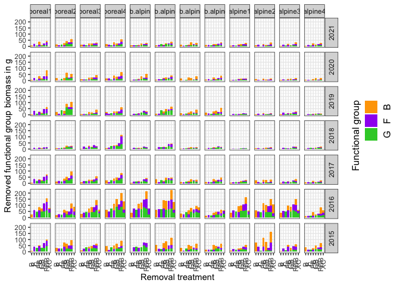

This is the git repository for the FunCaB project and base for the data
paper: Vandvik et al. (2022). Data descriptor: The role of functional
group interactions in mediating climate change impacts on the Carbon
dynamics and biodiversity of alpine ecosystems.

## Summary

Removal experiments allow disentangling of direct effects of climate
from indirect effects, resulting from changes in interactions among
species or functional groups with climate. Across the Vestland Climate
Grid (VCG), twelve sites in a climate grid spanning 4°C in growing
season temperature and 2000 mm in mean annual precipitation in Western
Norway, we conducted a fully factorial plant functional group removal
experiment (graminoids, forbs, bryophytes). Over six years, we recorded
biomass, soil microclimate, plant community composition, seedling
recruitment, ecosystem carbon fluxes, and reflectance in 384
experimental treatment and control plots. The datasets consists of 5215
biomass records, 1,084,970 soil temperature records, 4,412 soil moisture
records, 14,044 plant records covering 191 taxa, 3,696 carbon fluxes
measurements, and XXX reflectance measurements. The data can be combined
with other data collected within the VCG on longer-term climate data and
plant population, community, ecosystem, and functional trait data.

## Datasets

<table>
<thead>
<tr>
<th style="text-align:left;">
Number
</th>
<th style="text-align:left;">
Variable
</th>
<th style="text-align:left;">
Period
</th>
<th style="text-align:left;">
Filename
</th>
</tr>
</thead>
<tbody>
<tr>
<td style="text-align:left;">
i
</td>
<td style="text-align:left;">
Biomass removal
</td>
<td style="text-align:left;">
2015 - 2021
</td>
<td style="text-align:left;">
FunCaB_clean_biomass_2015-2021.csv
</td>
</tr>
<tr>
<td style="text-align:left;">
ii
</td>
<td style="text-align:left;">
Soil microclimate
</td>
<td style="text-align:left;">
2015 - 2018
</td>
<td style="text-align:left;">
FunCaB_clean_soilMoisture_2015-2018.csv
</td>
</tr>
<tr>
<td style="text-align:left;">
</td>
<td style="text-align:left;">
</td>
<td style="text-align:left;">
2015 - 2016
</td>
<td style="text-align:left;">
FunCaB_clean_soiltemperature_2015-2016.csv
</td>
</tr>
<tr>
<td style="text-align:left;">
iii
</td>
<td style="text-align:left;">
Plant community composition
</td>
<td style="text-align:left;">
2015 - 2019
</td>
<td style="text-align:left;">
FunCaB_clean_composition_2015-2018.csv
</td>
</tr>
<tr>
<td style="text-align:left;">
iv
</td>
<td style="text-align:left;">
Seedling recruitment
</td>
<td style="text-align:left;">
2018 - 2019
</td>
<td style="text-align:left;">
FunCaB…
</td>
</tr>
<tr>
<td style="text-align:left;">
v
</td>
<td style="text-align:left;">
Ecosystem carbon fluxes
</td>
<td style="text-align:left;">
2015 - 2017
</td>
<td style="text-align:left;">
FunCaB_clean_Cflux_2015-2017.csv
</td>
</tr>
<tr>
<td style="text-align:left;">
vi
</td>
<td style="text-align:left;">
Reflectance
</td>
<td style="text-align:left;">
2019 - 2021
</td>
<td style="text-align:left;">
FunCaB…
</td>
</tr>
</tbody>
</table>

**Project description**, **data dictionaries**, and the overview of all
**data sets** are in the data paper (REF).

The **raw** and **clean data** from the project are stored and available
on **OSF**: <https://osf.io/4c5v2/>

All **R code** to clean and curate the data is on **GitHub repository**:
<https://github.com/Between-the-Fjords/funcab_data>

### Naming conventions across datasets

This is the naming convention used across the datasets and can be used
to link the datasets. These variables are also used in the datasets from
the Vestland Climate Grid (VCG) and can be used to join these datasets.
Note that the turfID contains information about the control plots from
the VCG.

| Data or file | Description of naming convention                                                                                                 | Example                            |
|:-------------|:---------------------------------------------------------------------------------------------------------------------------------|:-----------------------------------|
| File names   | Project_status_Dataset_Year.extension                                                                                            | FunCaB_clean_biomass_2015-2021.csv |
| year         | Year of observation                                                                                                              | 2015                               |
| date         | Date of observation                                                                                                              | yyyy-mm–dd                         |
| date_time    | Date and time of observation                                                                                                     | yyyy-mm-dd hh-mm-ss                |
| siteID       | Unique siteID                                                                                                                    | Vikesland                          |
| blockID      | Unique blockID as a combination of siteID and block number                                                                       | Arh3                               |
| plotID       | Unique plotID as a combination of siteID, block and treatment                                                                    | Arh3FGB                            |
| treatment    | Treatment of functional group removal indicating which groups have been removed; F = forbs, G = graminoids, B = Bryophytes       | C, B, F, G, FB, GB, GF, FGB        |
| turfID       | Unique turfID corresponding to the Vestland Climate Grid control plots                                                           | Arh3FGB                            |
| species      | Vascular plant taxon names follow for Norway (Lid J & Lid, 2010). The full taxa is written using genus and species with a blank. | Rancunculus acris                  |
| responses    | response variable                                                                                                                | cover, biomass, Reco, etc.         |

## Data dictionaries

### Biomass removal

### Biomass

<!-- -->

<table>
<thead>
<tr>
<th style="text-align:left;">
Variable name
</th>
<th style="text-align:left;">
Description
</th>
<th style="text-align:left;">
Variable type
</th>
<th style="text-align:left;">
Variable range or levels
</th>
<th style="text-align:left;">
Units/treatment level
</th>
<th style="text-align:left;">
How measured
</th>
</tr>
</thead>
<tbody>
<tr>
<td style="text-align:left;">
year
</td>
<td style="text-align:left;">
Year of sampling
</td>
<td style="text-align:left;">
numeric
</td>
<td style="text-align:left;">
2015 - 2021
</td>
<td style="text-align:left;">
2016
</td>
<td style="text-align:left;">
defined
</td>
</tr>
<tr>
<td style="text-align:left;">
date
</td>
<td style="text-align:left;">
Date of sampling
</td>
<td style="text-align:left;">
date
</td>
<td style="text-align:left;">
2015-07-22 - 2021-07-30
</td>
<td style="text-align:left;">
yyyy-mm-dd
</td>
<td style="text-align:left;">
defined
</td>
</tr>
<tr>
<td style="text-align:left;">
round
</td>
<td style="text-align:left;">
Round of sampling
</td>
<td style="text-align:left;">
numeric
</td>
<td style="text-align:left;">
1 - 2
</td>
<td style="text-align:left;">
numeric value
</td>
<td style="text-align:left;">
defined
</td>
</tr>
<tr>
<td style="text-align:left;">
siteID
</td>
<td style="text-align:left;">
Unique site ID
</td>
<td style="text-align:left;">
categorical
</td>
<td style="text-align:left;">
Alrust - Vikesland
</td>
<td style="text-align:left;">
Alrust
</td>
<td style="text-align:left;">
defined
</td>
</tr>
<tr>
<td style="text-align:left;">
blockID
</td>
<td style="text-align:left;">
Unique block ID a combination of site and block
</td>
<td style="text-align:left;">
categorical
</td>
<td style="text-align:left;">
Alr1 - Vik5
</td>
<td style="text-align:left;">
Alr3
</td>
<td style="text-align:left;">
defined
</td>
</tr>
<tr>
<td style="text-align:left;">
plotID
</td>
<td style="text-align:left;">
Unique plot ID is a combination of site, block and treatment
</td>
<td style="text-align:left;">
categorical
</td>
<td style="text-align:left;">
Alr1B - Vik5GF
</td>
<td style="text-align:left;">
Alr1FGB
</td>
<td style="text-align:left;">
defined
</td>
</tr>
<tr>
<td style="text-align:left;">
treatment
</td>
<td style="text-align:left;">
Composition of functional groups in the plot with FGB = Forbs,
Graminoids, Bryophytes; FG = Forbs,Graminoids; FB = Forbs, Bryophytes;
GB = Graminoids, Bryophytes; G = Graminoids, F = Forbs, B = Bryophytes,
C = Control, XC = Additional control
</td>
<td style="text-align:left;">
categorical
</td>
<td style="text-align:left;">
B - GF
</td>
<td style="text-align:left;">
FGB
</td>
<td style="text-align:left;">
defined
</td>
</tr>
<tr>
<td style="text-align:left;">
removed_fg
</td>
<td style="text-align:left;">
Removed functional group with sampling: F = Forbs, G = Graminoids, B =
Bryophytes
</td>
<td style="text-align:left;">
categorical
</td>
<td style="text-align:left;">
B - G
</td>
<td style="text-align:left;">
F
</td>
<td style="text-align:left;">
defined
</td>
</tr>
<tr>
<td style="text-align:left;">
biomass
</td>
<td style="text-align:left;">
Dry weight of removed functional group
</td>
<td style="text-align:left;">
numeric
</td>
<td style="text-align:left;">
0 - 41.31
</td>
<td style="text-align:left;">
g
</td>
<td style="text-align:left;">
measured
</td>
</tr>
<tr>
<td style="text-align:left;">
name
</td>
<td style="text-align:left;">
Name of data collector
</td>
<td style="text-align:left;">
categorical
</td>
<td style="text-align:left;">
AB - William
</td>
<td style="text-align:left;">
NA
</td>
<td style="text-align:left;">
recorded
</td>
</tr>
<tr>
<td style="text-align:left;">
remark
</td>
<td style="text-align:left;">
Remarks
</td>
<td style="text-align:left;">
categorical
</td>
<td style="text-align:left;">
Bag: 05.08.21 - treatment says GF not FG
</td>
<td style="text-align:left;">
NA
</td>
<td style="text-align:left;">
NA
</td>
</tr>
</tbody>
</table>

### Soil microclimate

<table>
<thead>
<tr>
<th style="text-align:left;">
Variable name
</th>
<th style="text-align:left;">
Description
</th>
<th style="text-align:left;">
Variable type
</th>
<th style="text-align:left;">
Variable range or levels
</th>
<th style="text-align:left;">
Units/treatment level
</th>
<th style="text-align:left;">
How measured
</th>
</tr>
</thead>
<tbody>
<tr>
<td style="text-align:left;">
year
</td>
<td style="text-align:left;">
Year of sampling
</td>
<td style="text-align:left;">
numeric
</td>
<td style="text-align:left;">
2016 - 2016
</td>
<td style="text-align:left;">
2016
</td>
<td style="text-align:left;">
defined
</td>
</tr>
<tr>
<td style="text-align:left;">
date_time
</td>
<td style="text-align:left;">
Date and time of sampling
</td>
<td style="text-align:left;">
date_time
</td>
<td style="text-align:left;">
2015-07-12 17:58:01 - 2016-06-27 23:05:01
</td>
<td style="text-align:left;">
yyyy-mm-dd hh:mm:ss
</td>
<td style="text-align:left;">
defined
</td>
</tr>
<tr>
<td style="text-align:left;">
siteID
</td>
<td style="text-align:left;">
Unique site ID
</td>
<td style="text-align:left;">
categorical
</td>
<td style="text-align:left;">
Alrust - Vikesland
</td>
<td style="text-align:left;">
Alrust
</td>
<td style="text-align:left;">
defined
</td>
</tr>
<tr>
<td style="text-align:left;">
blockID
</td>
<td style="text-align:left;">
Unique block ID a combination of site and block
</td>
<td style="text-align:left;">
categorical
</td>
<td style="text-align:left;">
Alr1 - Vik5
</td>
<td style="text-align:left;">
Alr3
</td>
<td style="text-align:left;">
defined
</td>
</tr>
<tr>
<td style="text-align:left;">
plotID
</td>
<td style="text-align:left;">
Unique plot ID is a combination of site, block and treatment
</td>
<td style="text-align:left;">
categorical
</td>
<td style="text-align:left;">
Alr1B - Vik5GF
</td>
<td style="text-align:left;">
Alr1FGB
</td>
<td style="text-align:left;">
defined
</td>
</tr>
<tr>
<td style="text-align:left;">
iButtonID
</td>
<td style="text-align:left;">
Unique iButton ID
</td>
<td style="text-align:left;">
categorical
</td>
<td style="text-align:left;">
003E3B5C41_2016 - F83E3E2A41_2016
</td>
<td style="text-align:left;">
3BC3A141
</td>
<td style="text-align:left;">
defined
</td>
</tr>
<tr>
<td style="text-align:left;">
treatment
</td>
<td style="text-align:left;">
Composition of functional groups in the plot with FGB = Forbs,
Graminoids, Bryophytes; FG = Forbs,Graminoids; FB = Forbs, Bryophytes;
GB = Graminoids, Bryophytes; G = Graminoids, F = Forbs, B = Bryophytes,
C = Control, XC = Additional control
</td>
<td style="text-align:left;">
categorical
</td>
<td style="text-align:left;">
B - GF
</td>
<td style="text-align:left;">
FGB
</td>
<td style="text-align:left;">
defined
</td>
</tr>
<tr>
<td style="text-align:left;">
comments
</td>
<td style="text-align:left;">
Additional comments
</td>
<td style="text-align:left;">
categorical
</td>
<td style="text-align:left;">
According to tag on the logger - wrong number: 8B0000003E391041
</td>
<td style="text-align:left;">
NA
</td>
<td style="text-align:left;">
NA
</td>
</tr>
<tr>
<td style="text-align:left;">
turfID
</td>
<td style="text-align:left;">
Unique turf ID from SeedClim transplant experiment
</td>
<td style="text-align:left;">
categorical
</td>
<td style="text-align:left;">
101 TTC - 73 TTC
</td>
<td style="text-align:left;">
31 TTC
</td>
<td style="text-align:left;">
defined
</td>
</tr>
</tbody>
</table>
<table>
<thead>
<tr>
<th style="text-align:left;">
Variable name
</th>
<th style="text-align:left;">
Description
</th>
<th style="text-align:left;">
Variable type
</th>
<th style="text-align:left;">
Variable range or levels
</th>
<th style="text-align:left;">
Units/treatment level
</th>
<th style="text-align:left;">
How measured
</th>
</tr>
</thead>
<tbody>
<tr>
<td style="text-align:left;">
date
</td>
<td style="text-align:left;">
Date of sampling
</td>
<td style="text-align:left;">
date
</td>
<td style="text-align:left;">
2015-06-02 - 2018-08-29
</td>
<td style="text-align:left;">
yyyy-mm-dd
</td>
<td style="text-align:left;">
defined
</td>
</tr>
<tr>
<td style="text-align:left;">
siteID
</td>
<td style="text-align:left;">
Unique site ID
</td>
<td style="text-align:left;">
categorical
</td>
<td style="text-align:left;">
Alrust - Vikesland
</td>
<td style="text-align:left;">
Alrust
</td>
<td style="text-align:left;">
defined
</td>
</tr>
<tr>
<td style="text-align:left;">
blockID
</td>
<td style="text-align:left;">
Unique block ID a combination of site and block
</td>
<td style="text-align:left;">
categorical
</td>
<td style="text-align:left;">
Alr - Vik5
</td>
<td style="text-align:left;">
Alr3
</td>
<td style="text-align:left;">
defined
</td>
</tr>
<tr>
<td style="text-align:left;">
plotID
</td>
<td style="text-align:left;">
Unique plot ID is a combination of site, block and treatment
</td>
<td style="text-align:left;">
categorical
</td>
<td style="text-align:left;">
Alr1B - Vik5GF
</td>
<td style="text-align:left;">
Alr1FGB
</td>
<td style="text-align:left;">
defined
</td>
</tr>
<tr>
<td style="text-align:left;">
treatment
</td>
<td style="text-align:left;">
Composition of functional groups in the plot with FGB = Forbs,
Graminoids, Bryophytes; FG = Forbs,Graminoids; FB = Forbs, Bryophytes;
GB = Graminoids, Bryophytes; G = Graminoids, F = Forbs, B = Bryophytes,
C = Control, XC = Additional control
</td>
<td style="text-align:left;">
categorical
</td>
<td style="text-align:left;">
B - GF
</td>
<td style="text-align:left;">
FGB
</td>
<td style="text-align:left;">
defined
</td>
</tr>
<tr>
<td style="text-align:left;">
soilmoisture
</td>
<td style="text-align:left;">
Plotlevel soil moisture
</td>
<td style="text-align:left;">
numeric
</td>
<td style="text-align:left;">
0 - 100
</td>
<td style="text-align:left;">
percentage
</td>
<td style="text-align:left;">
recorded
</td>
</tr>
<tr>
<td style="text-align:left;">
soilmoisture
</td>
<td style="text-align:left;">
Soilmoisture measurement associated with light measurement from
soilmoisture dataset
</td>
<td style="text-align:left;">
numeric
</td>
<td style="text-align:left;">
0 - 100
</td>
<td style="text-align:left;">
m3 water/m3 soil
</td>
<td style="text-align:left;">
recorded
</td>
</tr>
<tr>
<td style="text-align:left;">
weather
</td>
<td style="text-align:left;">
Weather conditions during data collection
</td>
<td style="text-align:left;">
categorical
</td>
<td style="text-align:left;">
Blue sky - windy, cloudy
</td>
<td style="text-align:left;">
cloudy
</td>
<td style="text-align:left;">
recorded
</td>
</tr>
<tr>
<td style="text-align:left;">
recorder
</td>
<td style="text-align:left;">
Data collector
</td>
<td style="text-align:left;">
categorical
</td>
<td style="text-align:left;">
? - Vojta
</td>
<td style="text-align:left;">
NA
</td>
<td style="text-align:left;">
recorded
</td>
</tr>
<tr>
<td style="text-align:left;">
turfID
</td>
<td style="text-align:left;">
Unique turf ID from SeedClim transplant experiment
</td>
<td style="text-align:left;">
categorical
</td>
<td style="text-align:left;">
101 TTC - Ves 539 TTC 262
</td>
<td style="text-align:left;">
31 TTC
</td>
<td style="text-align:left;">
defined
</td>
</tr>
</tbody>
</table>

### Plant community composition

<!-- -->

<table>
<thead>
<tr>
<th style="text-align:left;">
Variable name
</th>
<th style="text-align:left;">
Description
</th>
<th style="text-align:left;">
Variable type
</th>
<th style="text-align:left;">
Variable range or levels
</th>
<th style="text-align:left;">
Units/treatment level
</th>
<th style="text-align:left;">
How measured
</th>
</tr>
</thead>
<tbody>
<tr>
<td style="text-align:left;">
year
</td>
<td style="text-align:left;">
Year of sampling
</td>
<td style="text-align:left;">
numeric
</td>
<td style="text-align:left;">
2015 - 2018
</td>
<td style="text-align:left;">
2016
</td>
<td style="text-align:left;">
defined
</td>
</tr>
<tr>
<td style="text-align:left;">
siteID
</td>
<td style="text-align:left;">
Unique site ID
</td>
<td style="text-align:left;">
categorical
</td>
<td style="text-align:left;">
Alrust - Vikesland
</td>
<td style="text-align:left;">
Alrust
</td>
<td style="text-align:left;">
defined
</td>
</tr>
<tr>
<td style="text-align:left;">
blockID
</td>
<td style="text-align:left;">
Unique block ID a combination of site and block
</td>
<td style="text-align:left;">
categorical
</td>
<td style="text-align:left;">
Alr1 - Vik5
</td>
<td style="text-align:left;">
Alr3
</td>
<td style="text-align:left;">
defined
</td>
</tr>
<tr>
<td style="text-align:left;">
treatment
</td>
<td style="text-align:left;">
Composition of functional groups in the plot with FGB = Forbs,
Graminoids, Bryophytes; FG = Forbs,Graminoids; FB = Forbs, Bryophytes;
GB = Graminoids, Bryophytes; G = Graminoids, F = Forbs, B = Bryophytes,
C = Control, XC = Additional control
</td>
<td style="text-align:left;">
categorical
</td>
<td style="text-align:left;">
B - XC
</td>
<td style="text-align:left;">
FGB
</td>
<td style="text-align:left;">
defined
</td>
</tr>
<tr>
<td style="text-align:left;">
turfID
</td>
<td style="text-align:left;">
Unique turf ID from SeedClim transplant experiment
</td>
<td style="text-align:left;">
categorical
</td>
<td style="text-align:left;">
Alr1B - Vik5GF
</td>
<td style="text-align:left;">
31 TTC
</td>
<td style="text-align:left;">
defined
</td>
</tr>
<tr>
<td style="text-align:left;">
graminoidCov
</td>
<td style="text-align:left;">
Cover of graminoids
</td>
<td style="text-align:left;">
numeric
</td>
<td style="text-align:left;">
0 - 100
</td>
<td style="text-align:left;">
percentage
</td>
<td style="text-align:left;">
recorded
</td>
</tr>
<tr>
<td style="text-align:left;">
forbCov
</td>
<td style="text-align:left;">
Cover of forbs
</td>
<td style="text-align:left;">
numeric
</td>
<td style="text-align:left;">
0 - 100
</td>
<td style="text-align:left;">
percentage
</td>
<td style="text-align:left;">
recorded
</td>
</tr>
<tr>
<td style="text-align:left;">
mossCov
</td>
<td style="text-align:left;">
Cover of bryophytes
</td>
<td style="text-align:left;">
numeric
</td>
<td style="text-align:left;">
0 - 120
</td>
<td style="text-align:left;">
percentage
</td>
<td style="text-align:left;">
recorded
</td>
</tr>
<tr>
<td style="text-align:left;">
vegetationHeight
</td>
<td style="text-align:left;">
Height of vegetation
</td>
<td style="text-align:left;">
numeric
</td>
<td style="text-align:left;">
0 - 267.5
</td>
<td style="text-align:left;">
mm
</td>
<td style="text-align:left;">
measured
</td>
</tr>
<tr>
<td style="text-align:left;">
mossHeight
</td>
<td style="text-align:left;">
Height of bryophytes
</td>
<td style="text-align:left;">
numeric
</td>
<td style="text-align:left;">
0 - 120
</td>
<td style="text-align:left;">
mm
</td>
<td style="text-align:left;">
measured
</td>
</tr>
<tr>
<td style="text-align:left;">
litter
</td>
<td style="text-align:left;">
Cover of litter
</td>
<td style="text-align:left;">
numeric
</td>
<td style="text-align:left;">
1 - 100
</td>
<td style="text-align:left;">
percentage
</td>
<td style="text-align:left;">
recorded
</td>
</tr>
<tr>
<td style="text-align:left;">
species
</td>
<td style="text-align:left;">
Species abbreviation
</td>
<td style="text-align:left;">
categorical
</td>
<td style="text-align:left;">
Ach.mil - Vio.tri
</td>
<td style="text-align:left;">
Ach.mil
</td>
<td style="text-align:left;">
defined
</td>
</tr>
<tr>
<td style="text-align:left;">
cover
</td>
<td style="text-align:left;">
Individual species cover
</td>
<td style="text-align:left;">
numeric
</td>
<td style="text-align:left;">
1 - 98
</td>
<td style="text-align:left;">
percentage
</td>
<td style="text-align:left;">
recorded
</td>
</tr>
<tr>
<td style="text-align:left;">
sumcover
</td>
<td style="text-align:left;">
Total sum of species cover
</td>
<td style="text-align:left;">
numeric
</td>
<td style="text-align:left;">
1 - 267
</td>
<td style="text-align:left;">
percentage
</td>
<td style="text-align:left;">
recorded
</td>
</tr>
</tbody>
</table>

### Ecosystem carbon fluxes

<!-- -->

<table>
<thead>
<tr>
<th style="text-align:left;">
Variable name
</th>
<th style="text-align:left;">
Description
</th>
<th style="text-align:left;">
Variable type
</th>
<th style="text-align:left;">
Variable range or levels
</th>
<th style="text-align:left;">
Units/treatment level
</th>
<th style="text-align:left;">
How measured
</th>
</tr>
</thead>
<tbody>
<tr>
<td style="text-align:left;">
year
</td>
<td style="text-align:left;">
Year of sampling
</td>
<td style="text-align:left;">
numeric
</td>
<td style="text-align:left;">
2015 - 2017
</td>
<td style="text-align:left;">
2016
</td>
<td style="text-align:left;">
defined
</td>
</tr>
<tr>
<td style="text-align:left;">
date
</td>
<td style="text-align:left;">
Date of sampling
</td>
<td style="text-align:left;">
date
</td>
<td style="text-align:left;">
2015-06-30 - 2017-08-01
</td>
<td style="text-align:left;">
yyyy-mm-dd
</td>
<td style="text-align:left;">
defined
</td>
</tr>
<tr>
<td style="text-align:left;">
siteID
</td>
<td style="text-align:left;">
Unique site ID
</td>
<td style="text-align:left;">
categorical
</td>
<td style="text-align:left;">
Alrust - Vikesland
</td>
<td style="text-align:left;">
Alrust
</td>
<td style="text-align:left;">
defined
</td>
</tr>
<tr>
<td style="text-align:left;">
blockID
</td>
<td style="text-align:left;">
Unique block ID a combination of site and block
</td>
<td style="text-align:left;">
categorical
</td>
<td style="text-align:left;">
Alr1 - Vik5
</td>
<td style="text-align:left;">
Alr3
</td>
<td style="text-align:left;">
defined
</td>
</tr>
<tr>
<td style="text-align:left;">
plotID
</td>
<td style="text-align:left;">
Unique plot ID is a combination of site, block and treatment
</td>
<td style="text-align:left;">
categorical
</td>
<td style="text-align:left;">
Alr1B - Vik5RTC
</td>
<td style="text-align:left;">
Alr1FGB
</td>
<td style="text-align:left;">
defined
</td>
</tr>
<tr>
<td style="text-align:left;">
treatment
</td>
<td style="text-align:left;">
Composition of functional groups in the plot with FGB = Forbs,
Graminoids, Bryophytes; FG = Forbs,Graminoids; FB = Forbs, Bryophytes;
GB = Graminoids, Bryophytes; G = Graminoids, F = Forbs, B = Bryophytes,
C = Control, XC = Additional control
</td>
<td style="text-align:left;">
categorical
</td>
<td style="text-align:left;">
B - XC
</td>
<td style="text-align:left;">
FGB
</td>
<td style="text-align:left;">
defined
</td>
</tr>
<tr>
<td style="text-align:left;">
starttime
</td>
<td style="text-align:left;">
Start time of light measurement
</td>
<td style="text-align:left;">
NA
</td>
<td style="text-align:left;">
NA
</td>
<td style="text-align:left;">
yyyy-mm-dd hh:mm:ss
</td>
<td style="text-align:left;">
recorded
</td>
</tr>
<tr>
<td style="text-align:left;">
starttime
</td>
<td style="text-align:left;">
Start time of light measurement
</td>
<td style="text-align:left;">
NA
</td>
<td style="text-align:left;">
NA
</td>
<td style="text-align:left;">
yyyy-mm-dd hh:mm:ss
</td>
<td style="text-align:left;">
recorded
</td>
</tr>
<tr>
<td style="text-align:left;">
stoptime
</td>
<td style="text-align:left;">
End time of light measurement
</td>
<td style="text-align:left;">
NA
</td>
<td style="text-align:left;">
NA
</td>
<td style="text-align:left;">
yyyy-mm-dd hh:mm:ss
</td>
<td style="text-align:left;">
recorded
</td>
</tr>
<tr>
<td style="text-align:left;">
stoptime
</td>
<td style="text-align:left;">
End time of light measurement
</td>
<td style="text-align:left;">
NA
</td>
<td style="text-align:left;">
NA
</td>
<td style="text-align:left;">
yyyy-mm-dd hh:mm:ss
</td>
<td style="text-align:left;">
recorded
</td>
</tr>
<tr>
<td style="text-align:left;">
time
</td>
<td style="text-align:left;">
Time in seconds for light measurement
</td>
<td style="text-align:left;">
numeric
</td>
<td style="text-align:left;">
0 - 195
</td>
<td style="text-align:left;">
second
</td>
<td style="text-align:left;">
recorded
</td>
</tr>
<tr>
<td style="text-align:left;">
PAR
</td>
<td style="text-align:left;">
PAR value of light measurment
</td>
<td style="text-align:left;">
numeric
</td>
<td style="text-align:left;">
4.658932 - 2555
</td>
<td style="text-align:left;">
µmol m-2 s-1
</td>
<td style="text-align:left;">
recorded
</td>
</tr>
<tr>
<td style="text-align:left;">
soiltemp
</td>
<td style="text-align:left;">
Soiltemperature value of light measurement
</td>
<td style="text-align:left;">
numeric
</td>
<td style="text-align:left;">
3 - 23.2
</td>
<td style="text-align:left;">
°C
</td>
<td style="text-align:left;">
recorded
</td>
</tr>
<tr>
<td style="text-align:left;">
vegHeight
</td>
<td style="text-align:left;">
Vegetation height of plot from plant community data set
</td>
<td style="text-align:left;">
numeric
</td>
<td style="text-align:left;">
0.01 - 27
</td>
<td style="text-align:left;">
mm
</td>
<td style="text-align:left;">
measured
</td>
</tr>
<tr>
<td style="text-align:left;">
nee
</td>
<td style="text-align:left;">
Net ecosystem exchange
</td>
<td style="text-align:left;">
numeric
</td>
<td style="text-align:left;">
-15.3924718105141 - 17.8854744852414
</td>
<td style="text-align:left;">
µmol mol-1 s-1 CO2
</td>
<td style="text-align:left;">
recorded
</td>
</tr>
<tr>
<td style="text-align:left;">
rsqd
</td>
<td style="text-align:left;">
R squared of slope of linear regression fitting the CO2 concentration
versus time
</td>
<td style="text-align:left;">
numeric
</td>
<td style="text-align:left;">
2.77252522336278e-07 - 1
</td>
<td style="text-align:left;">
NA
</td>
<td style="text-align:left;">
calculated
</td>
</tr>
<tr>
<td style="text-align:left;">
chamber
</td>
<td style="text-align:left;">
Carbon flux chamber
</td>
<td style="text-align:left;">
numeric
</td>
<td style="text-align:left;">
1 - 2
</td>
<td style="text-align:left;">
numeric value
</td>
<td style="text-align:left;">
defined
</td>
</tr>
<tr>
<td style="text-align:left;">
removal
</td>
<td style="text-align:left;">
Pre (2015) or post (> 2015) removal treatment
</td>
<td style="text-align:left;">
categorical
</td>
<td style="text-align:left;">
post - pre
</td>
<td style="text-align:left;">
pre or post
</td>
<td style="text-align:left;">
defined
</td>
</tr>
<tr>
<td style="text-align:left;">
weather
</td>
<td style="text-align:left;">
Weather conditions during data collection
</td>
<td style="text-align:left;">
categorical
</td>
<td style="text-align:left;">
cloud - Windy
</td>
<td style="text-align:left;">
cloudy
</td>
<td style="text-align:left;">
recorded
</td>
</tr>
<tr>
<td style="text-align:left;">
flag
</td>
<td style="text-align:left;">
Flag for data quality
</td>
<td style="text-align:left;">
categorical
</td>
<td style="text-align:left;">
1010 - sun
</td>
<td style="text-align:left;">
NA
</td>
<td style="text-align:left;">
NA
</td>
</tr>
<tr>
<td style="text-align:left;">
comment
</td>
<td style="text-align:left;">
Comment on measurment
</td>
<td style="text-align:left;">
categorical
</td>
<td style="text-align:left;">
–> - x
</td>
<td style="text-align:left;">
NA
</td>
<td style="text-align:left;">
NA
</td>
</tr>
<tr>
<td style="text-align:left;">
turfID
</td>
<td style="text-align:left;">
Unique turf ID from SeedClim transplant experiment
</td>
<td style="text-align:left;">
categorical
</td>
<td style="text-align:left;">
101 TTC - 99 TTC
</td>
<td style="text-align:left;">
31 TTC
</td>
<td style="text-align:left;">
defined
</td>
</tr>
<tr>
<td style="text-align:left;">
soilmoisture
</td>
<td style="text-align:left;">
Plotlevel soil moisture
</td>
<td style="text-align:left;">
numeric
</td>
<td style="text-align:left;">
0 - 76.775
</td>
<td style="text-align:left;">
percentage
</td>
<td style="text-align:left;">
recorded
</td>
</tr>
<tr>
<td style="text-align:left;">
soilmoisture
</td>
<td style="text-align:left;">
Soilmoisture measurement associated with light measurement from
soilmoisture dataset
</td>
<td style="text-align:left;">
numeric
</td>
<td style="text-align:left;">
0 - 76.775
</td>
<td style="text-align:left;">
m3 water/m3 soil
</td>
<td style="text-align:left;">
recorded
</td>
</tr>
<tr>
<td style="text-align:left;">
recorder
</td>
<td style="text-align:left;">
Data collector
</td>
<td style="text-align:left;">
categorical
</td>
<td style="text-align:left;">
Alba - Vojta
</td>
<td style="text-align:left;">
NA
</td>
<td style="text-align:left;">
recorded
</td>
</tr>
<tr>
<td style="text-align:left;">
tempK
</td>
<td style="text-align:left;">
Air temperature in the chamber during light measurement
</td>
<td style="text-align:left;">
numeric
</td>
<td style="text-align:left;">
279.225 - 312.783579166667
</td>
<td style="text-align:left;">
Kelvin
</td>
<td style="text-align:left;">
recorded
</td>
</tr>
<tr>
<td style="text-align:left;">
starttime_Reco
</td>
<td style="text-align:left;">
Start time of dark measurement
</td>
<td style="text-align:left;">
NA
</td>
<td style="text-align:left;">
NA
</td>
<td style="text-align:left;">
yyyy-mm-dd hh:mm:ss
</td>
<td style="text-align:left;">
recorded
</td>
</tr>
<tr>
<td style="text-align:left;">
starttime_Reco
</td>
<td style="text-align:left;">
Start time of dark measurement
</td>
<td style="text-align:left;">
NA
</td>
<td style="text-align:left;">
NA
</td>
<td style="text-align:left;">
yyyy-mm-dd hh:mm:ss
</td>
<td style="text-align:left;">
recorded
</td>
</tr>
<tr>
<td style="text-align:left;">
stoptime_Reco
</td>
<td style="text-align:left;">
End time of dark measurement
</td>
<td style="text-align:left;">
NA
</td>
<td style="text-align:left;">
NA
</td>
<td style="text-align:left;">
yyyy-mm-dd hh:mm:ss
</td>
<td style="text-align:left;">
recorded
</td>
</tr>
<tr>
<td style="text-align:left;">
stoptime_Reco
</td>
<td style="text-align:left;">
End time of dark measurement
</td>
<td style="text-align:left;">
NA
</td>
<td style="text-align:left;">
NA
</td>
<td style="text-align:left;">
yyyy-mm-dd hh:mm:ss
</td>
<td style="text-align:left;">
recorded
</td>
</tr>
<tr>
<td style="text-align:left;">
time_Reco
</td>
<td style="text-align:left;">
Time in seconds for dark measurement
</td>
<td style="text-align:left;">
numeric
</td>
<td style="text-align:left;">
5 - 180
</td>
<td style="text-align:left;">
second
</td>
<td style="text-align:left;">
recorded
</td>
</tr>
<tr>
<td style="text-align:left;">
PAR_Reco
</td>
<td style="text-align:left;">
PAR value of dark measurment
</td>
<td style="text-align:left;">
numeric
</td>
<td style="text-align:left;">
0 - 140.131404958678
</td>
<td style="text-align:left;">
µmol m-2 s-1
</td>
<td style="text-align:left;">
recorded
</td>
</tr>
<tr>
<td style="text-align:left;">
soiltemp_Reco
</td>
<td style="text-align:left;">
Soiltemperature value of dark measurement
</td>
<td style="text-align:left;">
numeric
</td>
<td style="text-align:left;">
3 - 23.2
</td>
<td style="text-align:left;">
°C
</td>
<td style="text-align:left;">
recorded
</td>
</tr>
<tr>
<td style="text-align:left;">
vegHeight_Reco
</td>
<td style="text-align:left;">
Vegetation height of plot from plant community data set
</td>
<td style="text-align:left;">
numeric
</td>
<td style="text-align:left;">
0.01 - 27
</td>
<td style="text-align:left;">
mm
</td>
<td style="text-align:left;">
measured
</td>
</tr>
<tr>
<td style="text-align:left;">
Reco
</td>
<td style="text-align:left;">
Ecosystem respiration
</td>
<td style="text-align:left;">
numeric
</td>
<td style="text-align:left;">
0.549348643554148 - 30.3544492014396
</td>
<td style="text-align:left;">
µmol mol-1 s-1 CO2
</td>
<td style="text-align:left;">
recorded
</td>
</tr>
<tr>
<td style="text-align:left;">
rsqd_Reco
</td>
<td style="text-align:left;">
R squared of slope of linear regression fitting the CO2 concentration
versus time
</td>
<td style="text-align:left;">
numeric
</td>
<td style="text-align:left;">
0.800233433653397 - 1
</td>
<td style="text-align:left;">
NA
</td>
<td style="text-align:left;">
calculated
</td>
</tr>
<tr>
<td style="text-align:left;">
chamber_Reco
</td>
<td style="text-align:left;">
Carbon flux chamber
</td>
<td style="text-align:left;">
numeric
</td>
<td style="text-align:left;">
1 - 3
</td>
<td style="text-align:left;">
numeric value
</td>
<td style="text-align:left;">
defined
</td>
</tr>
<tr>
<td style="text-align:left;">
removal_Reco
</td>
<td style="text-align:left;">
Pre (2015) or post (> 2015) removal treatment
</td>
<td style="text-align:left;">
categorical
</td>
<td style="text-align:left;">
post - pre
</td>
<td style="text-align:left;">
pre or post
</td>
<td style="text-align:left;">
defined
</td>
</tr>
<tr>
<td style="text-align:left;">
weather_Reco
</td>
<td style="text-align:left;">
Weather conditions during light measurement
</td>
<td style="text-align:left;">
categorical
</td>
<td style="text-align:left;">
clouds - Windy
</td>
<td style="text-align:left;">
NA
</td>
<td style="text-align:left;">
recorded
</td>
</tr>
<tr>
<td style="text-align:left;">
flag_Reco
</td>
<td style="text-align:left;">
Flag for data quality
</td>
<td style="text-align:left;">
categorical
</td>
<td style="text-align:left;">
1010 - pre
</td>
<td style="text-align:left;">
NA
</td>
<td style="text-align:left;">
NA
</td>
</tr>
<tr>
<td style="text-align:left;">
comment_Reco
</td>
<td style="text-align:left;">
Comment on measurment
</td>
<td style="text-align:left;">
categorical
</td>
<td style="text-align:left;">
&Breezy - x
</td>
<td style="text-align:left;">
NA
</td>
<td style="text-align:left;">
NA
</td>
</tr>
<tr>
<td style="text-align:left;">
turfID_Reco
</td>
<td style="text-align:left;">
Unique turf ID from SeedClim transplant experiment
</td>
<td style="text-align:left;">
categorical
</td>
<td style="text-align:left;">
101 TTC - 99 TTC
</td>
<td style="text-align:left;">
31 TTC
</td>
<td style="text-align:left;">
defined
</td>
</tr>
<tr>
<td style="text-align:left;">
soilmoisture_Reco
</td>
<td style="text-align:left;">
Soilmoisture measurement associated with dark measurement from
soilmoisture dataset
</td>
<td style="text-align:left;">
numeric
</td>
<td style="text-align:left;">
0 - 76.775
</td>
<td style="text-align:left;">
m3 water/m3 soil
</td>
<td style="text-align:left;">
recorded
</td>
</tr>
<tr>
<td style="text-align:left;">
recorder_Reco
</td>
<td style="text-align:left;">
Recorder
</td>
<td style="text-align:left;">
categorical
</td>
<td style="text-align:left;">
Alba - Vojta
</td>
<td style="text-align:left;">
NA
</td>
<td style="text-align:left;">
NA
</td>
</tr>
<tr>
<td style="text-align:left;">
tempK_Reco
</td>
<td style="text-align:left;">
Air temperature in the chamber during dark measurement
</td>
<td style="text-align:left;">
numeric
</td>
<td style="text-align:left;">
279.225 - 311.97665
</td>
<td style="text-align:left;">
Kelvin
</td>
<td style="text-align:left;">
recorded
</td>
</tr>
<tr>
<td style="text-align:left;">
delta
</td>
<td style="text-align:left;">
Time difference between dark and light measurement
</td>
<td style="text-align:left;">
numeric
</td>
<td style="text-align:left;">
65 - 7050
</td>
<td style="text-align:left;">
second
</td>
<td style="text-align:left;">
calculated
</td>
</tr>
<tr>
<td style="text-align:left;">
gpp
</td>
<td style="text-align:left;">
Gross primary production calculated from nee - Reco
</td>
<td style="text-align:left;">
numeric
</td>
<td style="text-align:left;">
-24.3421116941431 - -0.00417718292151026
</td>
<td style="text-align:left;">
µmol mol-1 s-1 CO2
</td>
<td style="text-align:left;">
calculated
</td>
</tr>
<tr>
<td style="text-align:left;">
weather
</td>
<td style="text-align:left;">
Weather conditions during light measurement
</td>
<td style="text-align:left;">
categorical
</td>
<td style="text-align:left;">
cloud - Windy
</td>
<td style="text-align:left;">
NA
</td>
<td style="text-align:left;">
recorded
</td>
</tr>
<tr>
<td style="text-align:left;">
recorder
</td>
<td style="text-align:left;">
Recorder
</td>
<td style="text-align:left;">
categorical
</td>
<td style="text-align:left;">
Alba - Vojta
</td>
<td style="text-align:left;">
NA
</td>
<td style="text-align:left;">
NA
</td>
</tr>
</tbody>
</table>
